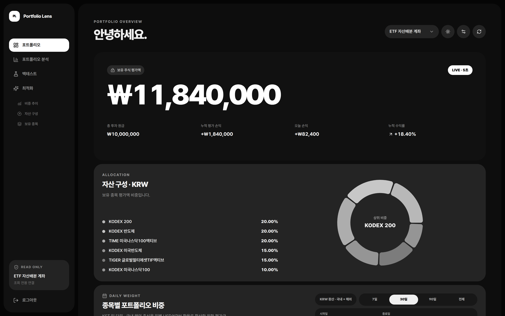
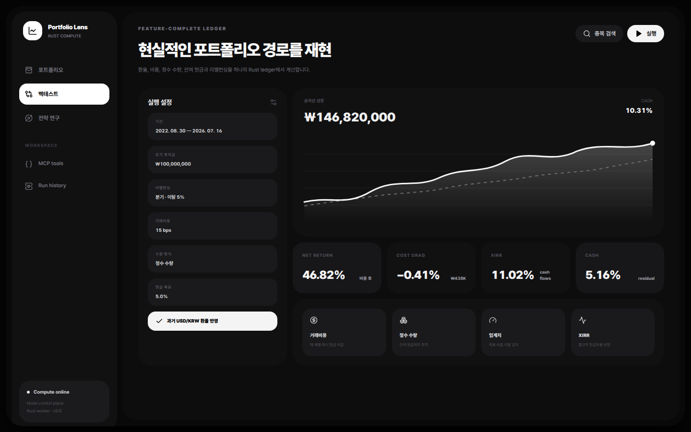
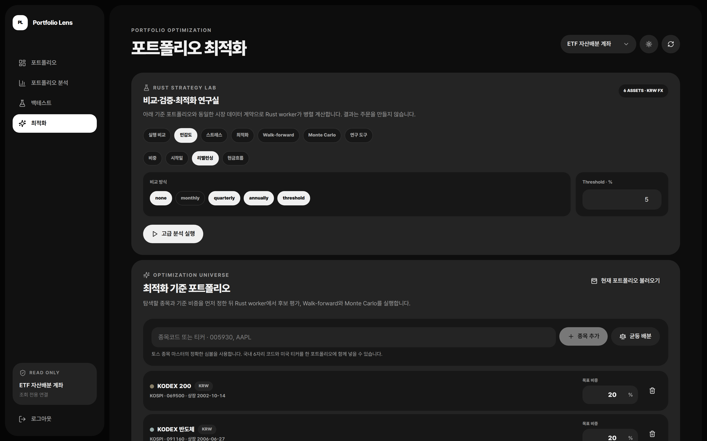
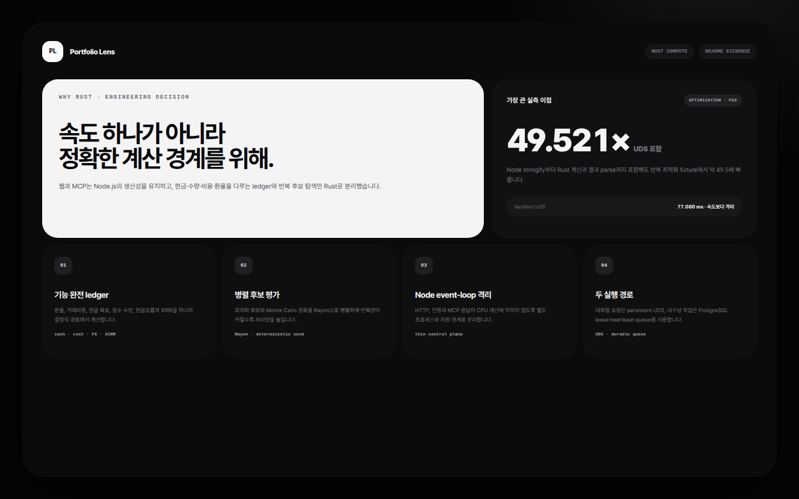
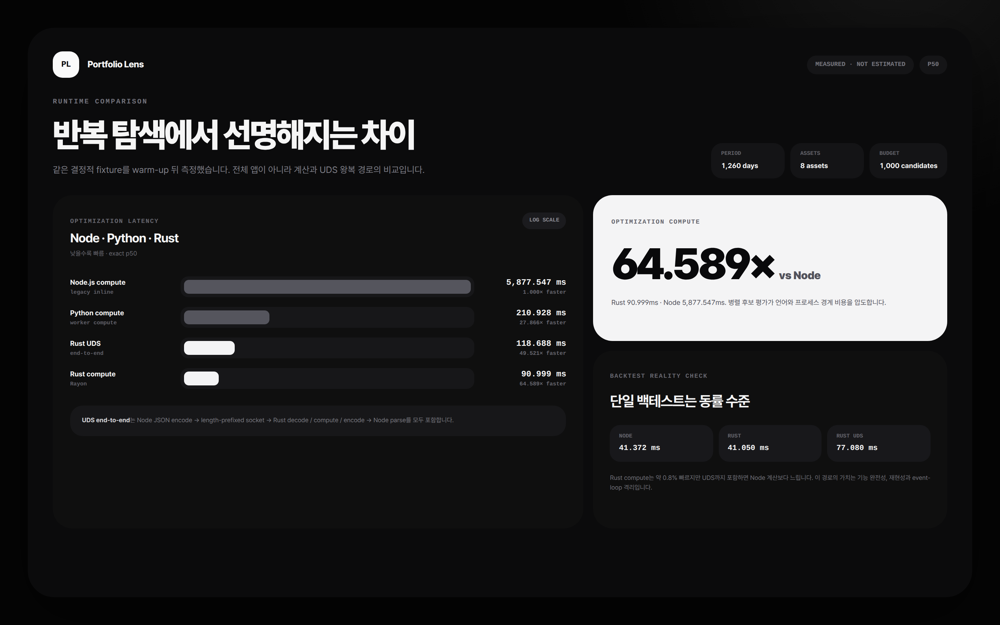
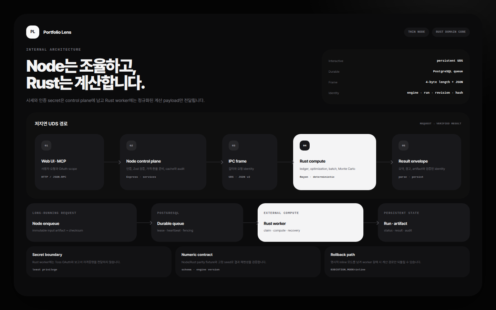

# Toss Portfolio Lens

토스증권 Open API 또는 호환 조회 API의 계좌·보유 종목·체결·시세 데이터를 모아 포트폴리오 현황, 성과 분석, 백테스트와 전략 연구를 제공하는 읽기 전용 애플리케이션입니다.

국내 상장 종목과 USD 해외 종목을 하나의 포트폴리오에서 분석할 수 있으며, 과거 USD/KRW 환율과 현금흐름을 반영한 원화 기준 성과 경로를 계산합니다. 주문 생성·정정·취소 기능은 제공하지 않습니다.



> 스크린샷은 실제 애플리케이션 컴포넌트와 API 계약에 결정적 문서용 데이터를 연결해 촬영했습니다. 실제 계좌나 실제 운용 성과를 나타내지 않습니다.

웹 애플리케이션은 `포트폴리오`, `포트폴리오 분석`, `기술적 분석`, `단타 보조`, `백테스트`, `최적화`, `실행·프리셋` 화면으로 구분됩니다. 모든 차트는 무채색 밝기와 선 패턴으로 계열을 구분하며 다크·라이트 테마, 반응형 레이아웃과 키보드 접근성을 지원합니다.

## 주요 기능

### 포트폴리오와 성과 분석

- 계좌별 평가금, 손익, 보유 종목과 자산 구성
- 일별 평가금과 과거 비중 변화 복원
- 국내·해외 자산의 KRW 통합 평가와 과거 USD/KRW 환율 반영
- TWR, XIRR, CAGR, 변동성, MDD, Sharpe, Sortino, Calmar
- VaR·CVaR, 낙폭 구간, 상관관계, 위험 기여도와 집중도
- KOSPI, KOSDAQ, Nasdaq 100, S&P 500 또는 사용자 지정 종목과 비교
- 가격·환율 관측률, 공통 수익률 관측일과 carry-forward 현황 표시

### 포트폴리오 백테스트

국내 6자리 종목 코드와 미국 티커를 함께 입력할 수 있습니다. 데이터가 캐시되어 있지 않으면 Node control plane이 필요한 수정주가와 환율을 공급자에서 조회해 캐시한 뒤 Rust worker에 계산을 요청합니다.



- 초기 투자금과 목표 현금 비중
- 소수 수량 또는 정수 수량·lot size와 잔여 현금
- 월·분기·연 단위 또는 목표 비중 이탈 임계치 리밸런싱
- 정기 현금흐름과 날짜별 사용자 지정 입출금
- 목표 비중, drift 감소 또는 전체 리밸런싱 방식
- 체결금액 기준 거래비용의 실제 포트폴리오 경로 차감
- 현금 수익률, TWR·XIRR, 수익 기여와 비용 효과
- 날짜별 목표 비중 정책과 국면별 순차 리밸런싱
- 배당 현금 지급·원천세, 매도세, 고정 슬리피지, 거래량 참여율과 시장 충격
- 상장·상장폐지 및 universe 편입 기간을 사용한 point-in-time 검증
- 여러 설정 비교, 시작일·비중·리밸런싱·현금흐름 민감도 분석

### 기술적 분석과 단타 보조

- Rust 공통 엔진의 31개 일·주봉 기술 지표, typed 조건 신호와 다음 안전 거래일 백테스트 연결
- 포트폴리오·사용자 지정 종목 동시 차트, 공통 지표 오버레이와 실제 체결 marker
- 단타 스캐너에서 국내 또는 미국 상장 시장을 선택하고 거래대금·거래량·변동성 상위 5~50종목 비교
- 토스증권 랭킹·보조 시세와 한국투자증권 REST·WebSocket 체결/호가를 결합한 1·5·15·30·60분봉
- 미국 종목은 NASDAQ·NYSE·AMEX 거래소 코드를 명시적으로 보존하고 미국 동부시간 정규장(09:30~16:00) 기준으로 계산
- 저유동성 필터의 거래대금은 국내 `SCALPING_MINIMUM_TRADING_AMOUNT`(KRW), 미국 `SCALPING_US_MINIMUM_TRADING_AMOUNT`(USD)를 사용하며 미국 값을 생략하면 공통 값으로 fallback
- 공개 시계열 모델의 batch 가격 전망과 시간 순서 Walk-forward 회고 검증; 모델이 없으면 값을 만들지 않고 unavailable 유지
- 과거 호가, 미국 전체 호가 깊이, 미국 프리마켓·애프터마켓 데이터가 없거나 분석 범위 밖이면 partial/unavailable로 표시
- 주문 생성·정정·취소와 자동 주문은 제공하지 않으며 단타 HTTP 경로는 UI 내부 전용으로 MCP에 노출하지 않음

### 전략 연구와 최적화



- 최소·최대 비중, 필수·제외 종목, 최대 종목 수와 sector·industry·국가·통화·자산유형 그룹 제약
- 최대 CAGR·누적수익률·Sharpe·Sortino·Calmar, 최소 변동성·CVaR 등 목적함수
- 동일비중·현재비중·역변동성·최소분산·Risk Parity/ERC·HRP와 평균연결·silhouette cut·군집 내/간 ERC를 사용하는 결정적 HERC-style 기준 후보
- Ledoit–Wolf 공분산 축소와 Differential Evolution, separable CMA-ES, NSGA-II, 직접 CVaR 탐색
- 빠른 screening 뒤 상위·Pareto 후보를 실제 현금·수량·비용 ledger로 재검증하는 2단계 최적화
- 최초 inner-train에서만 후보·공분산을 학습하고 rolling·anchored 시간순 OOS fold에서 평가하는 표본 내/OOS `robust_score`(단일 holdout 호환), 구성요소·가중치·가용 가중치와 OOS coverage 공개
- typed incremental Pareto 계산, screening/ledger 순위 변화와 지표 delta
- rolling·anchored Walk-forward, fold별 후보 예산, gap·embargo, seed 안정성과 stitched OOS equity
- OOS CAGR·MDD·Sharpe·Information Ratio와 벤치마크 승률
- 스트레스 구간과 다중 시나리오 비교
- moving-block·stationary·regime-conditioned bootstrap과 다변량 Student-t Monte Carlo
- 리밸런싱·현금흐름·현금 수익률·비용·정수 수량·lot size·인플레이션·고갈 확률과 현금흐름 조정 손실 확률 반영
- 과거 origin별 예측구간 coverage와 bias를 측정하는 Monte Carlo calibration
- 동적 계획법 또는 MCTS로 과거 정보만 사용하는 국면별 순차 리밸런싱 정책 탐색
- Walk-forward·Monte Carlo·stress·시장 국면·민감도를 결합한 포트폴리오 outlook
- 분산 후보, 시장 국면, 중복 자산, 수익 기여와 리밸런싱 계획 연구 도구
- seed를 고정한 결정적 후보 생성과 재현 가능한 결과

### 전망, 노출과 실행 기록

- 미래 수익률·잔액 분위수 경로, 손실·목표 달성·고갈 확률과 최악 stress 시나리오
- OOS equity, 검증 coverage, 데이터 품질과 구성요소별 신뢰도
- sector·industry·국가·통화·자산유형·factor 노출과 ETF 구성종목 look-through
- 환헤지 여부를 포함한 통화 노출 분석; 제공되지 않은 구성종목이나 hedge 정보는 `unknown`으로 유지
- 영구 run 검색·필터·태그·이름 변경·복제·보관·soft delete·재실행
- run event, 재현성 manifest와 대용량 artifact lazy loading
- 이름·설명·종목·기본 비중·현금·벤치마크·기간·리밸런싱·비용·최적화 제약을 저장하는 프리셋
- 현재 포트폴리오, 저장 run, 최적화 및 Pareto 후보에서 프리셋 생성
- 프리셋 생성·수정·복제·삭제·가져오기·내보내기, revision 변경 이력과 마지막 사용 시각

### MCP와 보고서

- 공식 TypeScript MCP SDK 기반 Streamable HTTP endpoint
- OAuth Authorization Code + PKCE와 scope 기반 도구 권한
- 포트폴리오·시장 데이터·백테스트·최적화·전망·실행 기록·프리셋을 포괄하는 MCP 도구
- 인자와 결과를 저장하지 않는 DB 기반 MCP 감사 로그
- 대용량 결과의 artifact/resource 외부화
- OpenAI 호환 API 또는 Amazon Bedrock을 이용한 선택적 AI 평가 보고서
- 보고서 JSON은 로컬 파일 또는 비공개 S3에 저장하고 고정 React 템플릿으로 렌더링

MCP는 기본적으로 비활성입니다. 연결 방법과 OAuth 설정은 [MCP와 ChatGPT 연결 가이드](docs/mcp-chatgpt.md)를 참고하세요.

<!-- MCP_TOOLS:START -->
<!-- `npm run docs:mcp`가 이 구간을 생성합니다. -->

현재 MCP 도구 수는 **53개**, canonical input/output schema hash는 `34ddcb8d606935ca7ab499c752ebcaea12fb8c1487d103f86e6ca452de8c8ea9`입니다.

| 도구 | 기능 | 기존 OAuth scope |
| --- | --- | --- |
| `search_instruments` | 코드·이름·시장·자산유형으로 국내·미국 주식과 ETF를 검색합니다. | `market:read` |
| `get_data_availability` | 종목별 수정주가 cache 기간·관측수와 공통 계산 기간을 확인합니다. | `market:read` |
| `get_price_series` | 수정 여부와 기준통화를 지정해 일·주·월 OHLC 시계열을 조회합니다. | `market:read` |
| `analyze_technical_signals` | 기존 지표 batch 요청과 typed 기술 조건 신호-only 요청을 함께 지원합니다. 지표·조건 평가는 하나의 Rust batch를 사용하고 종가 신호는 다음 공통 실제 관측일에만 계획합니다. | `market:read` |
| `validate_technical_strategy` | typed 조건·지표 참조·allocation·백테스트 연결과 데이터 가용성을 Rust 계산 없이 검증합니다. | `backtest:run` |
| `run_technical_strategy_backtest` | Rust에서 지표 계산→조건 평가→다음 안전 거래일 schedule→기존 ledger를 한 run으로 실행하며 주문은 만들지 않습니다. | `backtest:run` |
| `analyze_instrument` | 수정주가 수익률의 성과·위험·낙폭·tail risk와 벤치마크 상대성과를 분석합니다. | `market:read` |
| `analyze_asset_relationship` | 기준 종목과 비교 종목의 공통 관측일 수익률 상관·Beta·상대성과를 분석합니다. | `market:read` |
| `get_correlation_matrix` | 여러 자산의 수정주가 수익률을 전체 공통 거래일로 inner join해 상관행렬을 계산합니다. | `market:read` |
| `validate_backtest_config` | 백테스트 입력·비중·기간·데이터 가용성을 계산 실행 없이 검증합니다. presetId 사용 시 명시한 필드를 덮어쓰고 정책 부분 객체는 깊게 병합합니다. | `backtest:run` |
| `run_portfolio_backtest` | 현금·정수 수량·목표비중 정책·배당·세금·유동성 비용과 point-in-time universe를 ledger에 반영합니다. presetId 사용 시 명시한 필드를 덮어쓰고 정책 부분 객체는 깊게 병합합니다. | `backtest:run` |
| `compare_backtests` | 저장된 여러 백테스트 run의 지표·안정성·비용·데이터 품질을 비교합니다. | `backtest:run` |
| `get_backtest_artifact` | equity·drawdown·trades·rolling 등 저장된 run 산출물을 조회합니다. | `backtest:run` |
| `get_run_artifact` | 백테스트·최적화·검증·전망·노출·Pareto·연구 보고서 run의 저장 artifact를 조회합니다. | `backtest:run` |
| `get_current_portfolio` | 계좌 번호를 숨긴 opaque selector 기준으로 현재 종목과 원화 환산 비중을 조회합니다. | `portfolio:read` |
| `find_diversifying_assets` | 명시한 후보 또는 현재 cache universe에서 낮은 상관과 하락장 분산효과를 가진 자산을 찾습니다. | `market:read` |
| `analyze_market_regimes` | 벤치마크 수익률과 rolling 변동성으로 상승·하락·고변동·저변동 국면을 통계적으로 분류합니다. | `market:read` |
| `analyze_return_contribution` | 저장된 백테스트 run의 시간연결·현지가격·환율·위험 기여를 조회합니다. | `backtest:run` |
| `optimize_portfolio` | 기준·Pareto 후보를 탐색하고 표본 내/OOS robust score와 실제 ledger 재검증 순위·지표 차이를 제공합니다. presetId 사용 시 명시한 필드를 덮어쓰고 정책 부분 객체는 깊게 병합합니다. | `backtest:run` |
| `walk_forward_optimize` | rolling·anchored 학습과 gap·embargo, fold 예산·seed를 적용해 stitched OOS 성과와 안정성을 검증합니다. presetId 사용 시 명시한 필드를 덮어쓰고 정책 부분 객체는 깊게 병합합니다. | `backtest:run` |
| `stress_test_portfolio` | 비용·환율·현금흐름·리밸런싱·종목 제외 가정을 바꾼 복수 시나리오를 실행합니다. | `backtest:run` |
| `build_pareto_frontier` | 수익·변동성·MDD·CVaR·회전율·비용 기준 비지배 최적화 후보를 조회하며 async 모드에서는 취소 가능한 run과 artifact를 생성합니다. | `backtest:run` |
| `find_redundant_assets` | 높은 상관·유사 Beta·낙폭 경로를 기준으로 중복 가능 자산 쌍을 찾습니다. | `market:read` |
| `analyze_rebalance_plan` | 현재·목표 비중의 차이와 회전율·추정 비용을 계산하며 주문은 생성하지 않습니다. | `backtest:run` |
| `analyze_weight_sensitivity` | 특정 종목의 명시적 비중 범위에서 성과·위험 지표 변화를 실행합니다. | `backtest:run` |
| `analyze_start_date_sensitivity` | 시작일 이동에 따른 백테스트 성과와 위험 분포를 실행합니다. | `backtest:run` |
| `analyze_rebalance_sensitivity` | 없음·월·분기·연·threshold 리밸런싱 가정을 비교합니다. | `backtest:run` |
| `analyze_cash_flow_sensitivity` | 정기 납입·인출 금액·주기·기간 내 시점 변화가 백테스트에 미치는 영향을 실행합니다. | `backtest:run` |
| `simulate_portfolio_monte_carlo` | moving-block·stationary·regime bootstrap 또는 Student-t로 현금·비용·수량을 반영한 미래 분포와 calibration을 계산합니다. | `backtest:run` |
| `analyze_portfolio_outlook` | Walk-forward OOS·Monte Carlo calibration·stress·시장 국면·ledger 민감도를 하나의 취소 가능한 역사적 전망 run으로 결합합니다. | `backtest:run` |
| `analyze_portfolio_exposures` | sector·industry·국가·통화·자산유형·factor와 제공된 ETF 구성종목 look-through 노출을 집계하며 async 모드에서는 취소 가능한 run과 artifact를 생성합니다. | `market:read` |
| `explain_data_quality` | 가격·환율·벤치마크 관측률과 공통 거래일·carry-forward·cache revision을 설명합니다. | `market:read` |
| `get_run_status` | 비동기 run의 상태·진행률·완료 후보·검증 구간과 경고를 조회합니다. | `backtest:run` |
| `cancel_run` | 대기·실행 중인 분석·검증·전망·노출·Pareto·연구 보고서 run을 취소하고 기존 완료 결과는 보존합니다. | `backtest:run` |
| `get_run_result` | 완료된 비동기 run의 요약·상위 후보·설정·artifact index를 조회합니다. | `backtest:run` |
| `list_runs` | 영구 run을 이름·종류·상태·태그·보관 여부로 검색하고 cursor 페이지로 조회합니다. | `backtest:run` |
| `get_run_events` | run의 생성·시작·진행·취소·완료·재실행 이벤트를 시간순으로 조회합니다. | `backtest:run` |
| `export_run_manifest` | 입력·seed·data revision·Git/엔진/worker/MCP 버전과 artifact checksum을 고정한 manifest를 내보냅니다. | `backtest:run` |
| `update_run` | run의 표시 이름·태그·보관 상태만 수정하며 계산 결과와 manifest는 바꾸지 않습니다. | `backtest:run` |
| `duplicate_run` | 기존 run 입력과 manifest 출처를 보존한 독립 실행 사본을 만듭니다. | `backtest:run` |
| `delete_run` | run을 soft delete해 기본 목록과 결과 조회에서 숨기며 감사 가능한 복구 여지를 남깁니다. | `backtest:run` |
| `rerun_run` | 저장된 입력을 현재 data revision과 엔진에서 새 run으로 다시 실행합니다. | `backtest:run` |
| `list_portfolio_presets` | 백테스트·최적화 공통 프리셋을 이름·태그로 검색하고 마지막 사용 시각을 조회합니다. | `backtest:run` |
| `get_portfolio_preset` | 프리셋 snapshot과 선택적 변경 이력을 조회합니다. | `backtest:run` |
| `create_portfolio_preset` | 수동 설정·현재 포트폴리오·run·최적화/Pareto 후보 snapshot으로 프리셋을 생성합니다. | `backtest:run` |
| `update_portfolio_preset` | 낙관적 revision 검증과 변경 이력을 남기며 프리셋을 수정합니다. | `backtest:run` |
| `duplicate_portfolio_preset` | 프리셋의 독립 snapshot 사본을 생성합니다. | `backtest:run` |
| `delete_portfolio_preset` | 프리셋을 soft delete하고 기본 조회에서 숨깁니다. | `backtest:run` |
| `import_portfolio_presets` | versioned JSON 문서를 검증해 프리셋을 가져오고 충돌 정책을 적용합니다. | `backtest:run` |
| `export_portfolio_preset` | 프리셋을 schema version이 있는 이식 가능한 JSON 문서로 내보냅니다. | `backtest:run` |
| `generate_backtest_report` | 완료된 run에 기존 AI writer와 보고서 저장소를 사용해 공개 보고서 페이지를 생성합니다. | `report:generate` |
| `generate_research_report` | 최적화·Walk-forward·Monte Carlo·stress·outlook run에서 재현 가능한 JSON 또는 Markdown 보고서를 생성하며 async 모드에서는 취소 가능한 파생 run과 artifact를 제공합니다. | `report:generate` |
| `get_report` | 보고서 ID·유형·생성시각·run·모델·페이지 URL·data revision을 조회합니다. | `report:generate` |
<!-- MCP_TOOLS:END -->

## Rust를 사용하는 이유

웹 UI와 HTTP·인증·MCP 처리는 Node.js에 남기고, CPU 집약적인 계산은 Rust worker로 분리했습니다.



- 포트폴리오 최적화의 반복 후보 평가와 Monte Carlo 경로 생성을 Rayon으로 병렬 처리합니다.
- 백테스트의 현금·정수 수량·거래비용·현금흐름·XIRR을 하나의 타입 안전한 ledger에서 계산합니다.
- 계산 부하와 메모리 사용을 Express의 요청 처리 및 MCP control plane에서 격리합니다.
- 짧은 대화형 계산은 persistent Unix domain socket을 사용해 프로세스 시작 비용을 제거합니다.
- 장기 실행 작업은 PostgreSQL durable queue, lease, heartbeat와 recovery 경로를 선택할 수 있습니다.
- 고정 seed, 요청 hash, 엔진 버전과 데이터 revision을 함께 검증해 재현성을 유지합니다.

### 측정된 성능

아래 값은 저장소의 [벤치마크 원본](benchmarks/results/rust-ipc-benchmark-2026-07-18.json)에서 가져온 p50입니다.

| 작업 | Node.js 계산 | Rust 계산 | Rust UDS 왕복 | 결과 |
| --- | ---: | ---: | ---: | --- |
| 백테스트 | 41.372 ms | 41.050 ms | 77.080 ms | 계산 자체는 약 0.8% 빠른 동률 수준이며, IPC 포함 시 Node 계산보다 느림 |
| 최적화 | 5,877.547 ms | 90.999 ms | 118.688 ms | Rust 계산 64.589배, UDS 왕복 포함 49.521배 빠름 |



측정 환경은 Ryzen 5 5600G 12 logical cores, Node.js 22.14, Rust 1.97입니다. 1,260일·8자산과 1,000개의 결정적 후보 fixture를 사용했고 백테스트 10회, 최적화 3회를 측정했습니다.

UDS 왕복에는 Node JSON 직렬화, length-prefixed frame 전송, Rust decode·계산·encode와 Node parse가 포함됩니다. 시세 다운로드, DB 준비와 HTTP 왕복 시간은 포함하지 않습니다. 따라서 전체 애플리케이션이 49~65배 빨라졌다는 의미가 아니라, 이 fixture의 **반복 포트폴리오 최적화 경로**에서 얻은 가속입니다.

단일 백테스트에서 Rust의 주된 이점은 절대 속도보다 기능이 완전한 ledger, 결정적 실행과 Node event loop 격리입니다. 약 705KB의 백테스트 결과를 JSON으로 전달하는 직렬화 비용은 여전히 남아 있습니다. 상세 비교와 수치 동등성 결과는 [Rust 전환 보고서](docs/presentation/rust-migration-report.html)에서 확인할 수 있습니다.

확장된 연구 엔진의 최종 release 측정은 [advanced research benchmark](benchmarks/results/advanced-research-benchmark-2026-07-18.json)에 별도로 보존했습니다. 같은 8자산·1,260일 입력에서 10,000 후보는 Rust 계산 1.605초(약 6,230 후보/초), UDS 왕복 2.758초였고 Node 계산보다 37.5배 빨랐습니다. Monte Carlo 10,000경로×252일은 계산 중앙값 162.9ms, Walk-forward 11 folds·440 fold-candidates는 837.0ms였습니다. 10,000 후보의 VmHWM은 약 800MB로, 전체 후보와 artifact JSON 직렬화·복제가 현재 대규모 실행의 주된 메모리 병목입니다.

## 구조



Node.js는 인증, 요청 검증, 시세·환율 준비, 캐시, run 상태, artifact, 보고서와 MCP 응답을 담당합니다. Rust는 백테스트 ledger, 최적화, Walk-forward, 스트레스·민감도와 Monte Carlo를 담당합니다.

기본 `rust_socket` 모드는 4-byte big-endian 길이와 JSON payload를 사용하는 Unix domain socket으로 통신합니다. 요청과 응답의 schema version, engine version, run ID, job kind, data revision과 request hash를 서로 대조합니다.

### API, worker와 artifact 계약

- 모든 분석 입력은 UI와 MCP가 공유하는 Zod schema로 검증되며, `/api/portfolio/advanced/:operation`은 MCP 도구와 같은 handler를 호출합니다.
- 모든 MCP 도구는 schema 검증을 거치는 `/api/portfolio/tools/:toolName` HTTP 경로에서도 사용할 수 있습니다. 실행 기록과 프리셋은 사람이 쓰기 쉬운 전용 REST 경로도 제공합니다.
- 최적화, Walk-forward, stress, 민감도, Monte Carlo, outlook, 노출, Pareto 조회와 연구 보고서는 비동기 run으로 실행할 수 있고 상태 조회·취소·결과·artifact 계약을 공유합니다. 노출·Pareto·연구 보고서는 기존 동기 응답도 유지합니다.
- `rust_socket` 취소는 요청별 UDS 연결을 닫아 Rust의 cooperative checkpoint까지 즉시 전파하며 다른 pooled 요청은 유지합니다.
- worker 입력은 `schema_version`, `engine_version`, `run_id`, `job_kind`, `data_revision`, `request_hash`, `payload`를 포함합니다. 응답은 이 identity와 canonical `payload_hash`를 다시 제공하며 불일치하면 결과를 수락하지 않습니다.
- health의 `build`와 MCP initialize server identity에는 Git SHA, 앱·엔진·worker·MCP schema version, MCP 도구 수와 canonical schema hash가 포함됩니다.
- 긴 배열은 run 본문에서 분리됩니다. 대표 artifact는 `screening-candidates`, `ledger-validated-candidates`, `worker-pareto-frontier`, `regime-policy`, `walk-forward`, `monte-carlo-*`, `outlook-oos-equity`, `outlook-quantile-paths`, `outlook-calibration`, `outlook-worst-scenarios`, `outlook-sensitivity`, `outlook-market-regimes`입니다.
- artifact descriptor는 URI, JSON format, row/byte count, checksum, 생성시각, schema version과 data revision을 보존합니다. UI는 descriptor를 먼저 그리고 사용자가 펼칠 때 내용을 lazy load합니다.

### DB migration과 기존 데이터

애플리케이션 시작 시 SQLite, PostgreSQL, MySQL/MariaDB에서 checksum ledger를 확인하며 migration을 순서대로 적용합니다. SQLite와 PostgreSQL은 migration별 transaction을 사용합니다. MySQL/MariaDB의 DDL은 implicit commit될 수 있어 전체 DDL의 원자적 rollback을 보장하지 않으며, 대신 idempotent DDL과 migration ID/checksum 검증으로 재실행과 schema drift를 통제합니다. 이미 적용된 ID의 checksum이 달라지면 시작을 중단합니다.

| migration | 변경 | 기존 데이터 처리 |
| --- | --- | --- |
| `20260718_001_run_management` | `portfolio_backtest_runs`에 `name`, `tags_json`, `archived_at`, `deleted_at`, `replay_of`, `manifest_json`과 탐색 index 추가 | 기존 run을 유지하고 null tag를 `[]`로 backfill |
| `20260718_002_portfolio_presets` | `portfolio_presets`, `portfolio_preset_versions`, owner/revision 탐색 index 추가 | 기존 테이블·run·artifact에는 변경 없음 |
| `20260718_003_canonical_local_owner` | 웹 세션과 MCP OAuth의 로컬 owner를 `owner`로 통일 | legacy `dashboard-http`·`dashboard-report` 기록을 충돌 없는 경우 승격하고, 동일 identity 충돌 run은 canonical 사본을 우선해 보존 |
| `20260718_004_canonical_local_owner_reconciliation` | legacy owner 승격을 다시 조정하고 run·report의 동일 identity 충돌을 해소 | 충돌 run은 결정적 새 request hash와 canonical `replay_of`, 원래 owner/hash manifest를 남겨 함께 보존하고, report 충돌은 새 report-config hash로 보존 |

run 삭제와 프리셋 삭제는 기본 조회에서 숨기는 soft delete입니다. migration은 기존 결과나 artifact를 다시 계산하지 않습니다. 자동 down migration은 제공하지 않으므로 운영 DB는 업그레이드 전에 백업해야 합니다. 이전 앱으로 롤백할 때 추가 column/table은 그대로 둘 수 있으며, 완전한 schema 롤백이 필요하면 백업에서 복원합니다.

### HTTP와 MCP 사용 예시

웹 API 예시는 기존 로그인 세션 cookie를 그대로 사용합니다.

```bash
curl -sS -c /tmp/portfolio-lens-cookie \
  -H 'Content-Type: application/json' \
  -d "{\"password\":\"${DASHBOARD_PASSWORD}\"}" \
  http://localhost:3200/api/auth/login

# 영구 run 검색
curl -sS -b /tmp/portfolio-lens-cookie \
  'http://localhost:3200/api/portfolio/runs?kind=optimization&tag=review&limit=25'

# 같은 Zod/MCP handler를 사용하는 도구 HTTP 경로
curl -sS -b /tmp/portfolio-lens-cookie \
  -H 'Content-Type: application/json' \
  -d '{"archived":"active","kinds":[],"statuses":[],"tags":[],"limit":25}' \
  http://localhost:3200/api/portfolio/tools/list_runs

# 수동 프리셋 생성
curl -sS -b /tmp/portfolio-lens-cookie \
  -H 'Content-Type: application/json' \
  -d '{"name":"60/40 연구","tags":["example"],"symbols":["SPY","IEF"],"source":{"type":"manual"},"config":{"defaultWeights":{"SPY":0.6,"IEF":0.4},"cashWeight":0}}' \
  http://localhost:3200/api/portfolio/presets
```

MCP에서는 같은 기능을 `list_runs`, `create_portfolio_preset`, `optimize_portfolio`, `analyze_portfolio_outlook` 등으로 호출합니다. 장기 실행 응답의 `run_id`를 `get_run_status`에 전달하고, 완료 후 `get_run_result`와 `get_run_artifact`를 사용합니다. MCP OAuth scope와 연결 설정은 기존 가이드를 따릅니다.

`validate_backtest_config`, `run_portfolio_backtest`, `optimize_portfolio`, `walk_forward_optimize`는 선택적 `presetId`를 받습니다. 서버는 owner가 같은 프리셋의 저장 config를 실행 종류에 맞게 정규화한 뒤 요청에 명시된 최상위 필드를 덮어쓰고, `execution`·`realism`·`report`·`robustValidation`·`ledgerValidation`·`regimePolicySearch`의 부분 객체는 저장값에 재귀 병합합니다. 완성된 입력은 동일한 Zod schema와 배포 요청 상한으로 다시 검증합니다. 조회만으로 `lastUsedAt`은 바뀌지 않으며 실제 백테스트·최적화·Walk-forward 실행에 사용했을 때만 갱신됩니다. 보고서가 활성화된 프리셋은 직접 입력과 동일하게 `report:generate` scope를 추가로 요구합니다.

## 빠른 시작

### 요구 사항

- Docker
- Docker Compose v2
- 토스증권 Open API 자격증명 또는 읽기 전용 호환 API token

### Docker Compose

```bash
git clone <repository-url>
cd toss-portfolio-lens
cp .env.example .env
```

`.env`에서 웹 로그인과 세션 값을 먼저 설정합니다.

```dotenv
DASHBOARD_PASSWORD=replace-with-a-strong-password
SESSION_SECRET=replace-with-at-least-32-random-characters
```

토스증권 OAuth Client Credentials를 사용한다면 다음 값을 설정합니다.

```dotenv
TOSS_API_AUTH_MODE=oauth_client_credentials
TOSS_API_BASE_URL=https://openapi.tossinvest.com
CLIENT_ID=your-client-id
CLIENT_SECRET=your-client-secret
```

읽기 전용 호환 API를 사용한다면 OAuth 값 대신 다음을 설정합니다.

```dotenv
TOSS_API_AUTH_MODE=static_bearer
TOSS_API_BASE_URL=https://your-compatible-api.example.com
TOSS_API_BEARER_TOKEN=your-read-only-token
```

Node 웹 서버와 Rust UDS worker를 빌드해 실행합니다.

```bash
docker compose up --build -d
curl http://localhost:3200/api/health
```

브라우저에서 `http://localhost:3200`을 엽니다.

```bash
# 로그 확인
docker compose logs -f web compute-ipc

# 중지
docker compose down
```

기본 저장소는 SQLite이며 `portfolio_data` Docker volume에 저장됩니다. PostgreSQL과 MySQL/MariaDB 설정은 [.env.example](.env.example)에 있습니다. 외부 DB를 선택한 상태에서 연결이나 마이그레이션이 실패하면 다른 저장소로 자동 전환하지 않고 시작을 중단합니다.

### 로컬 개발

Docker 없이 개발하려면 Node.js 22와 Rust 1.97 toolchain이 필요합니다.

```bash
npm ci
npm run dev
```

- Web UI: `http://localhost:5173`
- Express API: `http://localhost:3200`
- Rust worker socket: `/tmp/toss-portfolio-lens-compute.sock`

`npm run dev`는 Vite, Express와 release Rust UDS worker를 함께 실행합니다. 명시적인 레거시 Node 계산 경로는 `npm run dev:legacy`로 실행할 수 있습니다.

## 실행 모드

| `EXECUTION_MODE` | 용도 | 요구 사항 |
| --- | --- | --- |
| `rust_socket` | 기본 로컬·단일 호스트 저지연 실행 | Rust UDS worker |
| `external` | 내구성 queue와 독립 worker | PostgreSQL |
| `inline` | 개발 호환·긴급 롤백용 Node 경로 | 추가 worker 없음 |

외부 worker 모드는 PostgreSQL에서만 사용할 수 있습니다.

```bash
EXECUTION_MODE=external docker compose --profile external-compute up --build -d --no-deps web compute-worker
```

Rust UDS 장애 시 데이터 volume을 유지한 채 inline으로 임시 전환할 수 있습니다.

```bash
EXECUTION_MODE=inline docker compose up -d --no-deps web
```

## 주요 환경 변수

| 변수 | 설명 |
| --- | --- |
| `DASHBOARD_PASSWORD` | 웹 로그인 비밀번호와 앱의 읽기 전용 API Bearer token |
| `SESSION_SECRET` | 로그인 세션 HMAC 서명 값, 32자 이상 |
| `APP_GIT_SHA` | `.git`이 없는 배포 이미지의 health/MCP build identity에 주입할 commit SHA |
| `TOSS_API_AUTH_MODE` | `oauth_client_credentials` 또는 `static_bearer` |
| `TOSS_API_BASE_URL` | 토스증권 또는 호환 API 주소 |
| `DB_PROVIDER` | `sqlite`, `postgresql`, `mysql` |
| `EXECUTION_MODE` | `rust_socket`, `external`, `inline` |
| `RUST_COMPUTE_*` | UDS socket, pool 크기와 timeout |
| `RUST_WORKER_*` | external worker poll, lease, heartbeat와 recovery |
| `MCP_ENABLED` | MCP endpoint 활성화 여부, 기본 `false` |
| `REPORT_AI_PROVIDER` | 선택적 보고서 provider, `openai` 또는 `bedrock` |
| `REPORTS_PATH` / `S3_*` | 보고서 JSON 저장 위치 |

전체 설정과 예시는 [.env.example](.env.example), MCP 전용 설정은 [.env.chatgpt.example](.env.chatgpt.example)을 참고하세요.

## 데이터와 보안 경계

- 브라우저에는 토스증권 자격증명, 업스트림 Bearer token과 DB 비밀번호를 전달하지 않습니다.
- 업스트림에는 계좌·보유자산·완료 체결·시세·종목·시장 지표의 조회 요청만 보냅니다.
- MCP 감사 로그에는 요청 인자, 결과와 OAuth token을 저장하지 않습니다.
- 주문 생성·정정·취소 endpoint와 broker 주문 side effect는 구현하지 않습니다. 리밸런싱 결과는 분석 계획일 뿐입니다.

### 데이터 공급자 한계와 품질 상태

공급자가 제공하지 않는 값을 통계적으로 그럴듯하게 채워 넣지 않습니다. 결과의 `warnings`, `data_quality`, `effective_period`, outlook `confidence`와 artifact의 data revision을 함께 확인해야 합니다.

- 자동 종목·가격·환율 준비는 현재 KRW와 USD 및 USD/KRW에 한정됩니다. JPY·EUR 등 ISO 통화는 노출과 hedge 상태를 입력·집계할 수 있지만 해당 통화의 역사적 FX 수익률은 자동 계산하지 않으며 `multi_currency_fx=partial`로 표시합니다.
- `currencyMode=KRW`는 공급된 과거 USD/KRW를 반영하고, `local`은 FX 효과를 제외한 현지통화 수익률 연구용입니다. 누락 FX는 직전 관측 carry-forward 횟수를 공개합니다.
- 수정주가의 split·분배금·기타 기업행위 반영 범위는 공급자 정의를 따릅니다. 현금 배당 ledger는 일자별 `cashDividend`가 있을 때만 계산하며, 없으면 수정주가 모드 또는 `unavailable` 경고를 반환합니다.
- 수수료, 매도세, 배당세, 고정 슬리피지와 시장 충격 계수는 사용자 가정입니다. 개인별 세법·공제·세금 lot을 추정하지 않습니다.
- 거래량이 없으면 참여율과 시장 충격을 계산하지 않고 `liquidityStatus`와 누락 관측 수를 반환합니다. 거래량 0을 임의의 유동성으로 바꾸지 않습니다.
- 상장일·상장폐지일과 universe 편입/제외 구간은 공급되거나 명시된 경우에만 point-in-time 필터를 강제합니다. 완전한 역사적 지수 구성종목 DB와 delisting return은 내장되어 있지 않습니다.
- ETF look-through는 요청에 실제 구성종목과 비중이 포함된 경우에만 계산합니다. 구성종목, sector·industry·국가·factor 또는 환헤지 여부가 없으면 해당 coverage를 낮추고 `unknown`/경고를 유지합니다.
- 정수 수량은 마지막으로 공급된 수정가격과 설정한 lot size를 사용합니다. 미래 corporate action으로 lot이 바뀌는 경우는 알 수 없습니다.
- 캐시가 부족하면 실행 전에 공급자에서 보충합니다. 공급자가 전체 기간을 제공하지 못하면 공통 기간이 짧아지며 임의로 역채움하지 않습니다.
- Walk-forward, bootstrap, Student-t, stress와 outlook은 모두 역사적 시뮬레이션입니다. calibration coverage와 bias는 과거 origin에 대한 검증이며 미래 성과 보장이 아닙니다.
- Outlook의 독립 시장 국면은 벤치마크(없으면 현재 비중 포트폴리오)의 각 날짜 직전 trailing 수익률·연환산 변동성을 고정 공개 임계값으로 분류합니다. 예측 모델이 아니며 전체 관측과 상태 전이는 `outlook-market-regimes` artifact에 보존됩니다.

### 알려진 구현 한계

- MCP `tools/list`의 도구별 입력과 공통 출력 envelope는 생성 계약과 exact-match 검증을 거칩니다. 다만 도구별 `result`·`data_quality`와 worker의 중첩 `payload`·`result`·artifact `content`는 현재 공통 JSON 값 계약이므로 모든 결과 필드가 개별 JSON Schema로 강타입화되지는 않았습니다.
- Monte Carlo의 기존 `totalReturnPercent`와 `cagrPercent`는 현금흐름이 있을 때 원시 잔액 기준입니다. 별도 `cashFlowAdjustedTerminalReturnPercent`와 손실 확률은 `(종료잔액 + 인출) / (초기자본 + 납입) - 1` 기준이지만 현금흐름 시점을 가중하지 않으므로 TWR·MWR이 아닙니다.
- typed incremental Pareto는 일반 후보에서 비교 비용을 줄이지만 frontier가 매우 큰 최악 입력은 여전히 O(N²)입니다. 10,000 후보 결과를 모두 보존하는 측정에서 최대 상주 메모리가 약 800MB였으며, streaming artifact와 외부 정렬은 아직 제공하지 않습니다.
- HERC는 평균연결 상관거리 계층, silhouette 기반 flat cut, 군집 내·군집 간 ERC를 조합한 결정적 HERC-style 구현입니다. Ward/gap-statistic을 쓰는 특정 Raffinot 구현을 그대로 재현하지 않으며 후속 제약 repair가 동일 위험기여를 바꿀 수 있습니다.
- golden parity는 기존 TypeScript/Node 공통 백테스트·최적화 수치와 Rust 결과를 비교합니다. 고급 optimizer·Walk-forward·Monte Carlo는 결정적 randomized fixture와 보존 불변식을 검증하지만 `proptest`/`fast-check` 기반 전 입력 생성 검사는 아직 없습니다.
- UI·HTTP·MCP parity 검사는 도구 inventory, Zod schema, route, client와 handler 연결을 자동 확인합니다. 50개 도구의 모든 입력 조합에 대한 의미론적 3경로 동일성 E2E는 아니며 Playwright smoke는 OAuth·보고서의 데스크톱/모바일·다크/라이트 렌더링에 한정됩니다.
- 노출·Pareto·연구 보고서의 비동기 파생 run은 Node 제어면 작업입니다. external Rust queue 환경에서도 영속 run/artifact를 만들지만 실행 중 Node 프로세스가 재시작되면 inline stale-run 복구 정책에 따라 실패 처리됩니다.
- 실행 기록에서 optimization·outlook·노출·Pareto는 전용 결과 UI를 다시 사용합니다. 저장된 Walk-forward·Monte Carlo 등 일부 run은 현재 lazy JSON 중심이며 라이브 연구실과 같은 모든 차트를 다시 구성하지 않습니다.

## 검증

```bash
npm run typecheck
npm test
npm run build
npm run test:rust-worker
npm run docs:mcp:check
cargo fmt --manifest-path worker/rust/Cargo.toml --check
cargo clippy --manifest-path worker/rust/Cargo.toml --all-targets -- -D warnings
cargo test --manifest-path worker/rust/Cargo.toml
npm run benchmark:rust-ipc
```

`npm run test:rust-worker`는 Node/Rust golden 수치, 모든 optimizer·Monte Carlo 방식, 동일 seed/input/data revision 재현성, data revision 독립성, Walk-forward OOS 누수 probe와 비용·현금·정수 수량 ledger 보존 법칙을 release worker에서 검증합니다. Vitest에는 UI operation·HTTP route·MCP tool/schema inventory parity 검사가 포함됩니다.

MCP 도구 표와 `server/mcp/generated-contract.json`은 코드에서 생성합니다. 위 README marker 구간을 직접 수정하지 말고 다음 명령을 사용합니다.

```bash
npm run docs:mcp
```

PostgreSQL 외부 worker 환경이 준비되어 있다면 다음 검증도 실행할 수 있습니다.

```bash
npm run test:postgres
npm run test:worker-queue
npm run test:rust-worker-postgres
```

README 제품 화면은 실제 애플리케이션에 결정적 fixture API를 연결한 뒤 Playwright로 캡처합니다. 1680×1050 viewport를 2배 device scale로 촬영해 3360×2100 PNG를 생성하며 실제 인증정보나 계좌 데이터를 사용하지 않습니다.

Rust 설명 화면은 shadcn/ui의 다크 토큰과 무테두리 컴포넌트 구성을 적용한 정적 [HTML+JS 원본](docs/readme/rust-engine.html)에서 2배 해상도인 2880×1800 PNG로 함께 생성합니다.

```bash
npm run docs:capture-readme
```

## 기술 스택

- React 19, TypeScript, Vite, Tailwind CSS, shadcn/ui, Radix UI, Recharts
- Express 5, Zod, MCP TypeScript SDK
- Rust 1.97, Rayon, Tokio, Unix domain socket
- SQLite, PostgreSQL, MySQL/MariaDB
- Vitest, Playwright, Cargo test·clippy
- Docker Compose, Kubernetes, CloudFormation

## 추가 문서

- [MCP와 ChatGPT 연결](docs/mcp-chatgpt.md)
- [Rust 전환과 성능 보고서](docs/presentation/rust-migration-report.html)
- [AWS 배포 가이드](infra/aws/README.md)
- [홈랩 배포 가이드](infra/homelab/README.md)
