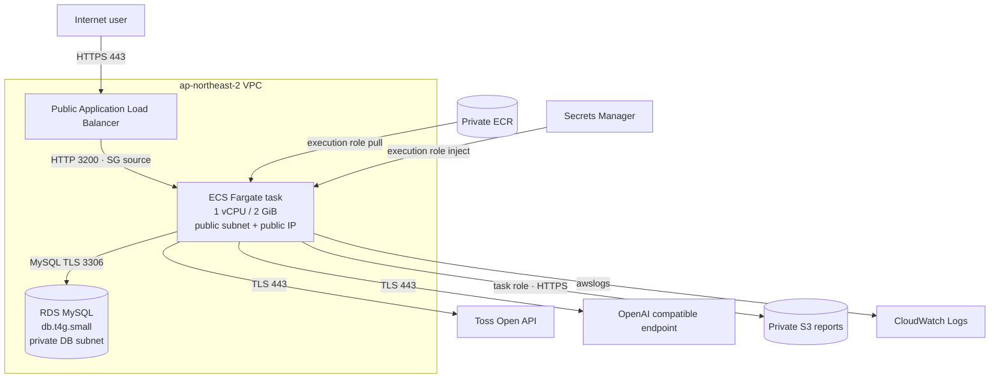
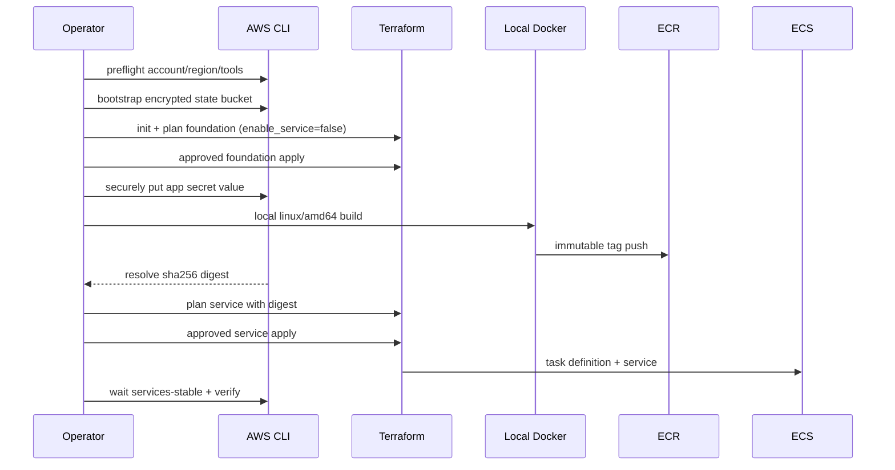

# Design Document

## 1. 범위와 전제

이 설계는 `toss-portfolio-lens-aws`라는 별도 IaC 저장소를 만든다. 애플리케이션 저장소는 로컬 `APP_SOURCE_DIR`로만 참조하며 Terraform 파일을 애플리케이션에 추가하지 않는다.

IaC 저장소가 관리하는 대상:

- VPC, subnet, route, security group
- ECR private repository
- RDS MySQL
- ECS cluster/task/service
- ALB, 선택적 ACM/Route 53 record
- private S3 report bucket
- Secrets Manager secret container와 IAM
- CloudWatch log group과 선택적 최소 alarm

IaC 저장소가 관리하지 않는 대상:

- 토스증권/OpenAI secret 값
- AWS IAM Identity Center 사용자·조직 설정
- Route 53 hosted zone 자체
- 애플리케이션 소스
- 실제 배포 승인

## 2. 목표 아키텍처



### 왜 ECS task가 public subnet인가

NAT Gateway를 제거하면서 task가 토스증권, OpenAI, ECR, S3, Secrets Manager에 outbound 접근해야 한다. Fargate task에 public IP를 부여하되 security group inbound는 ALB security group의 3200만 허용한다. public IP가 있어도 인터넷에서 task로 직접 연결할 수 없다.

모든 task를 private subnet에 두려면 NAT Gateway 또는 ECR API/DKR, S3, Logs, Secrets Manager 등 여러 VPC endpoint가 필요해 이 작은 서비스에서는 고정 비용과 구성이 증가한다.

## 3. 용량과 비용 결정

### ECS

AWS Fargate의 유효 조합:

| Profile | CPU | Memory | 사용 |
| --- | ---: | ---: | --- |
| 기본 | 1024 units = 1 vCPU | 2048 MiB = 2 GiB | 최소 비용, 기본값 |
| scale-up | 2048 units = 2 vCPU | 4096 MiB = 4 GiB | CPU 부족이 측정된 경우 |

2 vCPU/2 GiB는 Fargate task definition 등록 단계에서 거부되므로 지원하지 않는다. 정확히 2 vCPU/2 GiB가 필요하면 ECS on EC2의 `t4g.small` 같은 선택지가 있지만, EC2 patching·capacity·ARM image 관리가 추가되므로 기본 설계에서 제외한다.

### RDS

- class: `db.t4g.small` = 2 vCPU/2 GiB
- engine: MySQL 8.0 계열의 서울 리전 orderable version을 변수/사전 점검으로 선택
- Single-AZ
- gp3 20 GiB, autoscaling 50 GiB
- backup 1일
- Performance Insights/Enhanced Monitoring/log export off
- storage encryption on

### 주 비용 요인

ALB와 RDS는 트래픽이 적어도 지속 비용이 발생하고, Fargate task와 public IPv4도 실행 시간에 따라 과금된다. NAT Gateway, Multi-AZ, read replica, WAF, custom KMS key, autoscaling은 기본 생성하지 않는다. 가격은 변하므로 문서에는 금액을 고정하지 않고 배포 직전 AWS Pricing Calculator와 Cost Explorer/Budget 확인 절차를 둔다.

## 4. Terraform 저장소 구조

```text
toss-portfolio-lens-aws/
├── envs/
│   ├── production.backend.hcl.example
│   └── production.tfvars.example
├── scripts/
│   ├── lib.sh
│   ├── preflight.sh
│   ├── bootstrap-state.sh
│   ├── put-app-secret.sh
│   ├── build-and-push.sh
│   ├── plan.sh
│   ├── deploy.sh
│   ├── verify.sh
│   ├── rollback.sh
│   └── migrate-sqlite.md
├── tests/
│   └── defaults.tftest.hcl
├── versions.tf
├── providers.tf
├── variables.tf
├── locals.tf
├── networking.tf
├── ecr.tf
├── s3.tf
├── rds.tf
├── iam.tf
├── ecs.tf
├── alb.tf
├── dns.tf
├── monitoring.tf
├── outputs.tf
├── .gitignore
├── .terraform.lock.hcl
└── README.md
```

하위 module을 과도하게 만들지 않고 하나의 environment root module로 유지한다. 리소스가 많아지거나 staging 환경이 생길 때만 재사용 module을 추출한다.

## 5. Terraform version과 provider

```hcl
terraform {
  required_version = ">= 1.10, < 2.0"
  required_providers {
    aws = {
      source  = "hashicorp/aws"
      version = "~> <implementation-time-stable-major>.0"
    }
  }
  backend "s3" {}
}
```

Provider exact patch는 구현 시점의 안정 버전으로 lock file에 고정한다. backend는 partial config를 사용한다.

```hcl
# envs/production.backend.hcl — generated locally, gitignored
bucket       = "<globally-unique-state-bucket>"
key          = "toss-portfolio-lens/production/terraform.tfstate"
region       = "ap-northeast-2"
encrypt      = true
use_lockfile = true
```

DynamoDB locking은 만들지 않는다.

## 6. 변수 계약

### 식별과 계정

| Variable | Type/default | Validation |
| --- | --- | --- |
| `aws_region` | string/`ap-northeast-2` | 기본 서울, override 명시 |
| `expected_account_id` | string/required | 12 digits |
| `project_name` | string/`toss-portfolio-lens` | lowercase slug |
| `environment` | string/`production` | lowercase slug |
| `owner` | string/required | tag-safe |

Provider에 profile을 hard-code하지 않는다. `AWS_PROFILE` 환경 변수를 사용하고 script가 예상 account와 비교한다.

### 네트워크

| Variable | Default |
| --- | --- |
| `vpc_cidr` | `10.42.0.0/16` |
| `public_subnet_cidrs` | `10.42.0.0/24`, `10.42.1.0/24` |
| `private_db_subnet_cidrs` | `10.42.10.0/24`, `10.42.11.0/24` |

AZ는 `data.aws_availability_zones.available.names`의 앞 2개를 안정 정렬해 사용하거나 명시적 `availability_zones`를 받을 수 있다. list length 2 이상, CIDR 중복 금지를 validation/precondition으로 확인한다.

### ECS

| Variable | Default |
| --- | ---: |
| `enable_service` | `false` |
| `image_digest` | `null` |
| `task_cpu` | `1024` |
| `task_memory` | `2048` |
| `desired_count` | `1` |
| `use_fargate_spot` | `false` |
| `log_retention_days` | `7` |

`enable_service=true`이면 `image_digest`가 `sha256:<64 hex>`여야 한다. CPU/memory 조합은 공식 Fargate matrix allowlist로 validation한다.

### RDS

| Variable | Default |
| --- | --- |
| `db_instance_class` | `db.t4g.small` |
| `db_engine_version` | 구현 시점 서울 orderable MySQL 8.0 minor |
| `db_name` | `portfolio_lens` |
| `db_master_username` | `portfolio_admin` |
| `db_allocated_storage` | `20` |
| `db_max_allocated_storage` | `50` |
| `db_backup_retention_days` | `1` |
| `db_deletion_protection` | `true` |
| `db_skip_final_snapshot` | `false` |

Password 변수는 없다. `manage_master_user_password=true`를 쓴다.

### Domain

- `domain_name`: optional FQDN
- `route53_zone_id`: domain 사용 시 required
- 둘 다 없으면 HTTP ALB DNS를 output하고 production warning을 표시한다.

## 7. naming과 tags

```hcl
name_prefix = "${var.project_name}-${var.environment}"

common_tags = {
  Project     = var.project_name
  Environment = var.environment
  ManagedBy   = "Terraform"
  Owner       = var.owner
}
```

S3 이름은 account ID와 region을 포함해 global uniqueness를 만든다.

```text
<project>-<environment>-<account-id>-<region>-reports
```

IAM name/description, log group, ECS family에도 같은 prefix를 사용한다. 이름 길이 제한은 `substr`과 hash suffix로 안정적으로 처리한다.

## 8. state bootstrap 설계

State bucket은 그 bucket을 backend로 쓰는 main Terraform이 생성할 수 없으므로 `scripts/bootstrap-state.sh`가 AWS CLI로 관리한다.

### 동작

1. preflight와 exact confirmation
2. `head-bucket`으로 존재 여부 확인
3. 없으면 서울 LocationConstraint로 생성
4. account/bucket ownership 확인
5. public access block 네 값 true
6. SSE-S3 default encryption
7. versioning Enabled
8. bucket policy로 insecure transport 거부
9. 결과 bucket name으로 local backend HCL 생성

재실행은 버전·암호화·public block을 확인하고 보완하되 object나 version을 삭제하지 않는다. state bucket 삭제는 자동화하지 않는다.

## 9. 네트워크 리소스

### 리소스

- `aws_vpc`
- `aws_internet_gateway`
- public subnet × 2: `map_public_ip_on_launch=true`
- private DB subnet × 2: `map_public_ip_on_launch=false`
- public route table + IGW default route
- public associations × 2
- private route table: local route only
- private associations × 2

Default VPC와 default security group을 사용하지 않는다.

### Security groups

#### ALB SG

- ingress TCP/80 from `0.0.0.0/0`
- ingress TCP/443 from `0.0.0.0/0` when HTTPS
- egress TCP/3200 to ECS SG

#### ECS SG

- ingress TCP/3200 from ALB SG only
- egress TCP/3306 to RDS SG
- egress TCP/443 to `0.0.0.0/0` for external APIs/AWS endpoints
- DNS는 VPC resolver 접근이 가능하도록 필요한 UDP/TCP 53 egress를 명시하거나 VPC default resolver 동작을 검증한다.

#### RDS SG

- ingress TCP/3306 from ECS SG only
- application 요청에 필요한 응답 외 별도 internet egress 없음

AWS SG reference cycle을 피하도록 별도 `aws_vpc_security_group_ingress_rule`/`egress_rule` resource를 사용한다.

## 10. ECR 설계

```text
repository: <project>-<environment>
tag mutability: IMMUTABLE
scan on push: true
encryption: AES256
```

Lifecycle:

1. untagged image를 짧은 보존 기간 후 삭제
2. release tag image 최근 10개 보존

ECR repository는 `enable_service`와 무관하게 항상 생성한다. 첫 foundation apply 후 `build-and-push.sh`가 repository URL output을 읽는다.

### image build

```text
APP_SOURCE_DIR validation
→ docker buildx build --platform linux/amd64 --load
→ local smoke metadata inspection
→ aws ecr get-login-password | docker login --password-stdin
→ immutable release tag push
→ aws ecr describe-images
→ resolve digest
→ write gitignored release manifest
```

기본 tag는 `<git-short-sha>-<UTC timestamp>`다. dirty working tree는 기본 거부하고 `ALLOW_DIRTY_BUILD=1`을 명시한 경우에만 warning과 별도 suffix로 허용한다.

Release manifest 예:

```json
{
  "accountId": "000000000000",
  "region": "ap-northeast-2",
  "repository": "example",
  "tag": "abc1234-20260716T120000Z",
  "digest": "sha256:...",
  "sourceCommit": "abc1234...",
  "builtAt": "2026-07-16T12:00:00Z"
}
```

Account ID는 비밀은 아니지만 release manifest는 환경별 생성 파일로 Git ignore한다.

## 11. S3 보고서 bucket

### 설정

- public access block 4개 true
- Object Ownership: BucketOwnerEnforced
- SSE-S3 default encryption
- versioning은 비용과 복구 trade-off를 변수화; 기본 enabled를 권장
- incomplete multipart uploads 7일 후 abort
- object expiration 기본 없음
- `force_destroy=false`
- policy: `aws:SecureTransport=false` Deny

보고서 object는 `portfolio-reports/<uuid>.json` prefix에 저장한다. task role만 이 prefix에 `GetObject`, `PutObject`를 가진다. bucket list가 필요하면 `s3:prefix` condition으로 제한한다. `DeleteObject`는 앱이 삭제 기능을 제공하지 않으므로 부여하지 않는다.

S3 website, public ACL, presigned public report delivery를 사용하지 않는다. 사용자는 ALB/ECS의 `/reports/{uuid}`를 통해서만 본다.

## 12. RDS 설계

### Resource settings

```hcl
engine                       = "mysql"
instance_class               = "db.t4g.small"
allocated_storage            = 20
max_allocated_storage        = 50
storage_type                 = "gp3"
storage_encrypted            = true
multi_az                     = false
publicly_accessible          = false
manage_master_user_password  = true
backup_retention_period      = 1
copy_tags_to_snapshot        = true
performance_insights_enabled = false
monitoring_interval          = 0
```

`aws_db_subnet_group`은 두 private DB subnet을 사용한다. parameter group에서 `require_secure_transport=ON`을 사용하려면 해당 MySQL family와 app image의 CA 지원을 preflight로 먼저 확인한다.

### DB credential

RDS가 master password를 생성·회전하고 Secrets Manager secret ARN을 제공한다. ECS execution role은 그 secret의 `password` JSON key를 주입한다. `MYSQL_HOST`, `MYSQL_PORT`, `MYSQL_USER`, `MYSQL_DATABASE`는 task definition의 일반 environment다.

이 소규모 최소 비용 버전은 schema 생성·migration을 위해 app이 RDS master user를 사용한다. 향후 보안 강화 단계에서는 one-off bootstrap task로 database-scoped app user를 만들고 별도 managed secret을 사용하는 방식으로 전환할 수 있다. 이 절충을 README에 명시한다.

### TLS contract

운영 image는 다음 중 하나를 만족해야 한다.

1. 공식 Amazon RDS CA bundle을 image의 신뢰 저장소에 포함하거나,
2. `MYSQL_SSL_CA_PATH`를 읽고 bundle을 `mysql2` TLS `ca`로 전달한다.

Task는 `MYSQL_SSL=true`, `MYSQL_SSL_REJECT_UNAUTHORIZED=true`, `MYSQL_SSL_CA_PATH=<known-path>`를 설정한다. image가 이 contract를 만족하지 않으면 service enable을 중단한다.

## 13. Secrets Manager 설계

Terraform은 다음 secret metadata만 생성한다.

```text
/<project>/<environment>/app
```

`aws_secretsmanager_secret_version`은 만들지 않는다. 값이 Terraform state에 들어가지 않게 하기 위해 `scripts/put-app-secret.sh`가 AWS CLI로 넣는다.

### app secret JSON keys

```json
{
  "CLIENT_ID": "...",
  "CLIENT_SECRET": "...",
  "DASHBOARD_PASSWORD": "...",
  "SESSION_SECRET": "...",
  "OPENAI_API_ENDPOINT": "... or empty",
  "OPENAI_API_KEY": "... or empty",
  "OPENAI_MODEL": "... or empty"
}
```

Script는 `read -r`/`read -s`, `umask 077`, `mktemp`, trap cleanup을 사용한다. `set -x`를 금지하고 secret JSON을 stdout에 출력하지 않는다. AWS CLI call은 mode 600 temp file의 `file://` 입력을 사용한 뒤 즉시 제거한다.

Preflight는 `get-secret-value`의 payload를 출력하지 않고 JSON key 존재와 필수값 non-empty만 로컬 jq로 확인한다. `SESSION_SECRET`은 32자 이상을 확인하되 `DASHBOARD_PASSWORD`에는 최소 길이를 강제하지 않는다.

## 14. IAM 설계

### Task execution role

Trust principal: `ecs-tasks.amazonaws.com`

- AWS managed `service-role/AmazonECSTaskExecutionRolePolicy`
  - ECR auth/pull
  - CloudWatch Logs write
- inline:
  - `secretsmanager:GetSecretValue` on exact app secret ARN
  - `secretsmanager:GetSecretValue` on exact RDS master secret ARN
  - custom KMS decrypt only if a customer key is later enabled

이 role credential은 application container가 직접 사용하지 않는다.

### Application task role

Trust principal: `ecs-tasks.amazonaws.com`

- `s3:GetObject`, `s3:PutObject` on `<report-bucket>/<prefix>/*`
- 필요한 경우 `s3:ListBucket` on bucket with exact prefix condition
- `s3:GetBucketLocation` on bucket

Secrets Manager, ECR, ECS, Terraform, IAM 권한은 없다.

### Local deploy principal

README에 resource별 필요한 create/read/update/delete 권한을 분류한다. root user와 hard-coded access key를 금지하고 Identity Center permission set을 권장한다.

## 15. ECS task definition

### task settings

- family: `<project>-<environment>`
- `requires_compatibilities = ["FARGATE"]`
- `network_mode = "awsvpc"`
- CPU/memory validation matrix
- runtime: Linux/X86_64
- execution role와 task role 분리
- Fargate platform 1.4.0+

### container

| Field | Value |
| --- | --- |
| image | `${ecr_repository_url}@${image_digest}` |
| port | 3200/tcp |
| essential | true |
| user | image의 non-root user |
| logging | awslogs, region/log group/stream prefix |
| stop timeout | graceful shutdown 가능한 값 |

### 일반 environment

```text
NODE_ENV=production
HOST=0.0.0.0
PORT=3200
PUBLIC_APP_URL=<https-domain-or-alb-url>
DATABASE_PATH=/tmp/portfolio-history.sqlite
MYSQL_HOST=<rds-address>
MYSQL_PORT=3306
MYSQL_USER=<master-username>
MYSQL_DATABASE=portfolio_lens
MYSQL_REQUIRED=true
MYSQL_SSL=true
MYSQL_SSL_REJECT_UNAUTHORIZED=true
MYSQL_SSL_CA_PATH=/etc/ssl/certs/aws-rds-global-bundle.pem
S3_BUCKET=<report-bucket>
S3_REGION=ap-northeast-2
S3_PREFIX=portfolio-reports
AWS_REGION=ap-northeast-2
SNAPSHOT_REFRESH_HOURS=6
```

`S3_ENDPOINT`, static AWS keys, local report path는 설정하지 않는다.

### secret environment

ECS valueFrom JSON-key syntax를 사용한다.

- app secret: `CLIENT_ID`, `CLIENT_SECRET`, `DASHBOARD_PASSWORD`, `SESSION_SECRET`, `OPENAI_API_ENDPOINT`, `OPENAI_API_KEY`, `OPENAI_MODEL`
- RDS managed secret: `MYSQL_PASSWORD` ← `password`

Secret 값 변경은 실행 중 container에 자동 반영되지 않으므로 service force-new-deployment가 필요하다.

### Service

- desired count 1
- public subnet 2개, `assign_public_ip=true`
- ECS SG
- ALB target group attach
- deployment circuit breaker enable + rollback
- minimum healthy 100%, maximum 200%
- health check grace 90~180초 범위
- capacity provider: FARGATE 기본, FARGATE_SPOT opt-in

`enable_service=false`일 때 task definition과 service를 `count=0` 또는 `for_each={}`로 만들고 image digest 없이 foundation apply가 가능하게 한다.

## 16. ALB, ACM, DNS

### ALB

- internet-facing, IPv4
- public subnet 2개
- deletion protection 변수화, 기본 false 또는 production 정책에 맞게 true
- access logs 기본 off
- target type `ip`, protocol HTTP, port 3200
- health path `/api/health`, matcher 200, interval/timeout/threshold 보수 설정
- deregistration delay는 graceful update에 충분하면서 짧게 설정

### domain 없음

- HTTP 80 listener → target group
- output `http://<alb-dns>`
- README가 개인 테스트용이며 production login cookie와 금융 데이터에는 HTTPS가 필요하다고 경고

### domain 있음

- ACM certificate in `ap-northeast-2`
- existing Route 53 zone validation records
- HTTPS 443 listener, implementation 시점 AWS 권장 TLS policy
- HTTP 80 → HTTPS 301 redirect
- alias record to ALB
- `PUBLIC_APP_URL=https://<domain>`

Hosted zone 생성은 범위 밖이다. `domain_name`과 `route53_zone_id`는 함께 있거나 함께 없어야 한다.

## 17. CloudWatch와 health

### Logs

- log group `/ecs/<project>/<environment>`
- retention 7일
- application이 authorization/cookie/secret/금융 payload를 기록하지 않는 것이 전제
- log group 삭제 시 retention 데이터가 사라진다는 점을 문서화

### Health layers

1. process/container running
2. ALB `/api/health` HTTP 200
3. health JSON의 `storage=mysql`, `reportStorage=s3`
4. ECS desired/running count 1

ALB health에는 OpenAI/Toss live call을 넣지 않는다. RDS가 required mode에서 준비되지 않으면 app readiness가 실패해야 한다.

선택 alarm:

- target group `UnHealthyHostCount > 0`
- ECS running task count 부족 또는 service event 기반 점검
- SNS topic/email은 opt-in

## 18. 최초 배포 sequence

아래는 생성될 runbook의 논리 순서다. 이 Spec 문서 생성 단계에서는 실행하지 않는다.



### 첫 단계가 분리되는 이유

ECR repository가 생기기 전에 local push를 할 수 없고, 존재하지 않는 image를 참조하는 ECS service를 먼저 만들면 deployment가 실패한다. `enable_service=false` foundation apply가 이 순환을 끊는다.

## 19. 후속 release와 rollback

### 후속 release

1. preflight 및 clean source 확인
2. 새 immutable tag build/push
3. ECR digest resolve
4. `terraform plan -var=enable_service=true -var=image_digest=... -out=...`
5. plan summary에서 task definition image 외 예상치 못한 변경 확인
6. explicit apply
7. service stable + target health + API verify
8. release manifest를 last-known-good로 표시

### rollback

1. last-known-good digest 선택
2. ECR에 digest 존재 확인
3. Terraform plan으로 image digest만 되돌아가는지 확인
4. apply
5. circuit breaker/service stable/health 확인

ECS task definition revision만 직접 바꾸고 Terraform state를 방치하지 않는다. 긴급 `aws ecs update-service`를 사용했다면 즉시 Terraform 변수/state와 reconcile하는 절차를 둔다.

## 20. SQLite → RDS optional migration

기본 AWS 배포는 빈 RDS에서 시작한다. 기존 homelab SQLite를 자동으로 찾거나 전송하지 않는다.

Opt-in migration runbook:

1. 서비스 write/snapshot 수집을 잠시 중지하고 SQLite 사본과 checksum을 만든다.
2. report prefix와 분리된 `migration/<one-time-id>/` object로 private S3 upload한다.
3. object encryption, public block, 1일 lifecycle과 제한된 임시 IAM permission을 확인한다.
4. app image가 제공하는 one-off migration command 또는 S3 download sidecar + shared ephemeral volume task를 실행한다.
5. app의 idempotent SQLite→MySQL migration이 완료될 때까지 task log와 exit code를 확인한다.
6. table별 row count/fingerprint를 비교한다.
7. normal ECS service를 시작하고 `/api/health` storage=mysql, history 조회를 확인한다.
8. migration object와 임시 IAM policy/task definition을 제거한다.
9. 실패 시 migration 전 RDS snapshot으로 복원하거나 빈 DB를 재생성한다.

SQLite 파일을 image layer나 Terraform state에 넣는 방식은 금지한다. 이 runbook은 별도 사용자 승인이 필요하다.

## 21. scripts 안전 규칙

모든 Bash script:

```bash
#!/usr/bin/env bash
set -Eeuo pipefail
```

- 공통 `lib.sh`에서 command check, account/region assertion, confirmation, cleanup을 제공한다.
- 값이 있는지 검사할 때 secret을 echo하지 않는다.
- `set -x` 금지
- path는 quote하고 `APP_SOURCE_DIR=/` 같은 위험 경로를 거부한다.
- mutation은 `--execute`와 `DEPLOY_CONFIRM=<project>/<environment>/<account>` 같은 exact confirmation을 모두 요구한다.
- read-only `preflight`, `plan`, `verify`는 명확히 구분한다.
- saved plan과 release manifest는 `.artifacts/` gitignored 디렉터리에 둔다.
- destroy script는 기본 제공하지 않거나 별도 break-glass 문서로 두고 data protection 해제를 선행한다.

## 22. 검증 전략

### 오프라인·정적

```text
terraform fmt -check -recursive
terraform init -backend=false
terraform validate
terraform test
shellcheck scripts/*.sh
checkov -d .  # optional
```

Terraform test/assert:

- region default Seoul
- task 1024/2048 valid
- task 2048/2048 invalid
- RDS public false, Single-AZ, encrypted
- report bucket public block 4개 true
- no NAT Gateway resource
- ECS and execution IAM role ARN differ
- service enabled without digest fails validation
- domain/zone pair validation

### read-only cloud preflight

- STS expected account
- region
- 2개 이상 AZ
- RDS orderable class/version
- ECR repository/read access after foundation
- secret key presence without printing values
- image digest existence

### 배포 후

- `aws ecs wait services-stable`
- service desired=running=1
- target health healthy
- ALB/domain `/api/health` 200
- JSON `storage=mysql`, `reportStorage=s3`
- login page response and HTTPS redirect
- CloudWatch recent startup log에 secret 없음
- RDS public false, S3 public false를 AWS CLI read-only query로 재확인

## 23. Outputs

### non-sensitive

- `aws_account_id`
- `aws_region`
- `ecr_repository_url`
- `report_bucket_name`
- `ecs_cluster_name`
- `ecs_service_name` when enabled
- `alb_dns_name`
- `application_url`
- `rds_address`, `rds_port`, `db_name`
- `app_secret_arn` 또는 secret name(값은 아님)

Password, secret value, session key, OpenAI/Toss credential은 output하지 않는다.

## 24. 운영 runbook 목차

생성될 README는 다음 순서를 그대로 제공한다.

1. 사전 준비와 권한
2. account/region preflight
3. remote state bootstrap
4. backend init
5. foundation plan/apply
6. app secret 입력
7. local build and ECR push
8. service plan/apply
9. DNS/HTTPS
10. verification
11. routine release
12. secret rotation
13. rollback
14. optional SQLite migration
15. RDS backup/restore
16. data-safe teardown
17. 비용 점검
18. troubleshooting

각 mutation 명령 옆에 영향, 성공 기준, rollback을 적는다.

## 25. 공식 기준 문서

- [ECS Fargate CPU와 메모리 조합](https://docs.aws.amazon.com/AmazonECS/latest/developerguide/task-cpu-memory-error.html)
- [RDS DB instance class hardware](https://docs.aws.amazon.com/AmazonRDS/latest/UserGuide/Concepts.DBInstanceClass.Summary.html)
- [ECR CLI image push](https://docs.aws.amazon.com/AmazonECR/latest/userguide/getting-started-cli.html)
- [ECS task execution role](https://docs.aws.amazon.com/AmazonECS/latest/developerguide/task_execution_IAM_role.html)
- [ECS Secrets Manager JSON key injection](https://docs.aws.amazon.com/AmazonECS/latest/developerguide/secrets-envvar-secrets-manager.html)
- [S3 Block Public Access](https://docs.aws.amazon.com/AmazonS3/latest/userguide/access-control-block-public-access.html)
- [Terraform S3 backend and native lockfile](https://developer.hashicorp.com/terraform/language/backend/s3)
