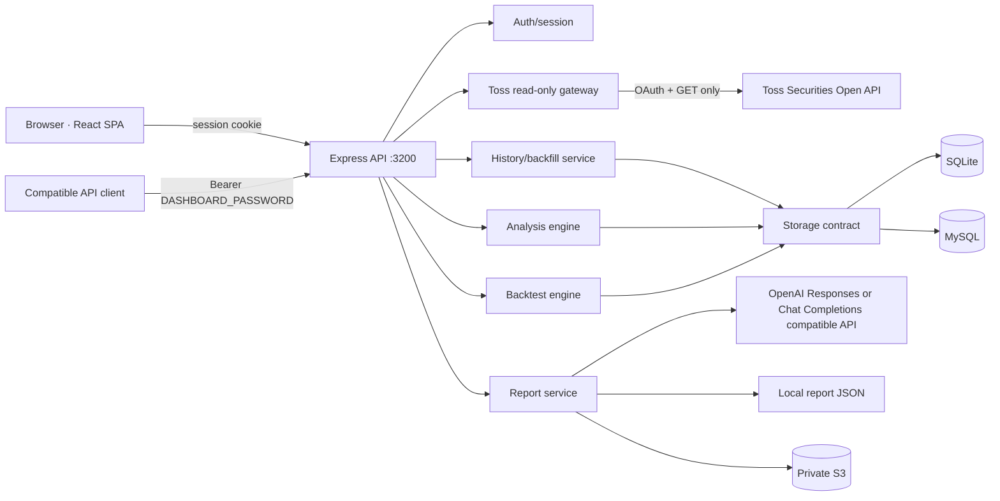
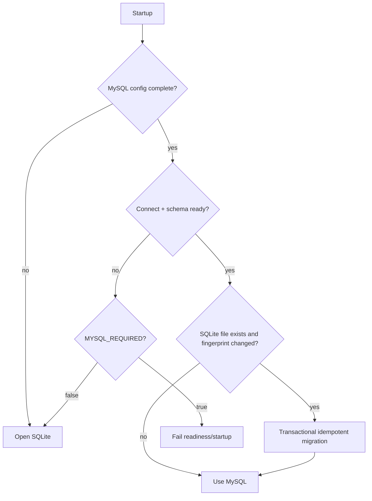
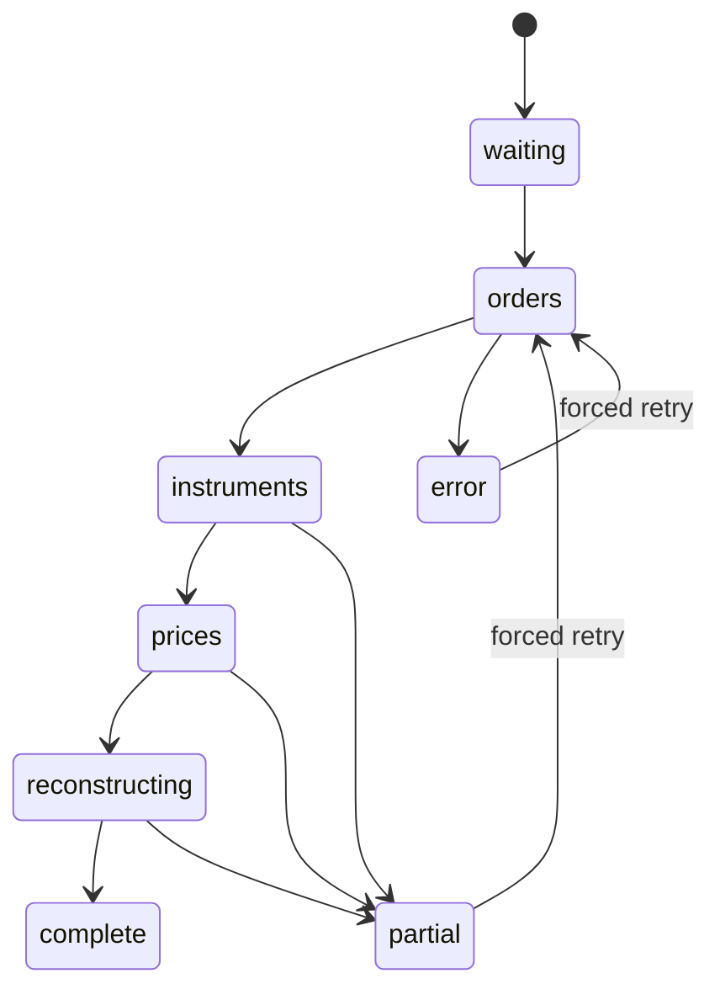
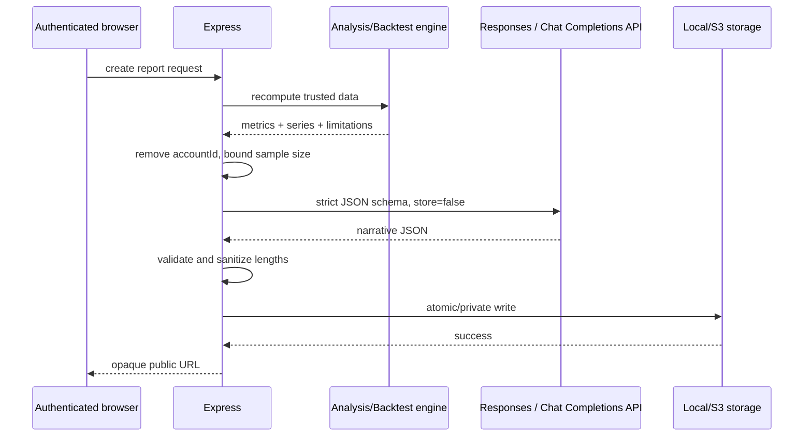

# Design Document

## 1. 개요

Portfolio Lens는 React SPA와 Express API를 하나의 Node.js 프로세스로 제공하는 개인용 읽기 전용 포트폴리오 애플리케이션이다. 서버만 토스증권, OpenAI, DB, S3에 접근하고 브라우저는 동일 origin API만 사용한다.

설계의 핵심은 다음 네 가지다.

1. 현재 계좌 데이터와 과거 재구성 데이터를 분리한다.
2. 체결·가격·환율 원본을 보존하고 화면용 지표는 결정적으로 다시 계산한다.
3. 실제 원장이 없는 값은 추정치와 한계를 함께 표시한다.
4. 로컬 단일 컨테이너와 AWS ECS/RDS/S3에서 같은 이미지가 동작한다.

## 2. 시스템 구조



### 신뢰 경계

- 브라우저는 비신뢰 입력 영역이다. 계좌 ID, 날짜, 종목, 비중을 모두 서버에서 재검증한다.
- Express 서버가 유일하게 비밀정보를 보유한다.
- 토스증권과 OpenAI 응답도 비신뢰 외부 입력으로 보고 schema를 정규화한다.
- SQLite/MySQL/S3 저장 데이터는 애플리케이션이 생성했더라도 읽을 때 schema version과 필수 필드를 확인한다.

## 3. 애플리케이션 모듈

| 모듈 | 책임 | 금지 사항 |
| --- | --- | --- |
| `server/env` | 환경 변수 파싱·검증·정규화 | secret 값 출력 |
| `server/auth` | password 검증, cookie 서명, rate limit | password/session 저장 |
| `server/toss` | OAuth, GET gateway, 응답 정규화 | 주문 mutation |
| `server/storage` | SQLite/MySQL 공통 contract, schema, migration | UI 계산 |
| `server/history` | 주문·일봉·환율 수집, 일별 snapshot 재구성 | HTTP 표현 로직 |
| `server/analysis` | 포트폴리오 OHLC, 벤치마크, 성과 지표 | 외부 secret 처리 |
| `server/backtest` | 가격 cache, 전략 simulation | 실제 주문 전송 |
| `server/reports` | 재계산, LLM 평가, 저장, 공개 조회 | LLM HTML 수용 |
| `src/components` | 접근 가능한 UI와 chart | 직접 외부 API 호출 |
| `src/lib` | 표시용 순수 계산·format·상태 직렬화 | 서버 secret import |

## 4. 런타임 구성 계약

### 필수 환경 변수

| 이름 | 제약 | 용도 |
| --- | --- | --- |
| `CLIENT_ID` | non-empty | 토스 상위 API client ID |
| `CLIENT_SECRET` | non-empty | 토스 상위 API client secret |
| `DASHBOARD_PASSWORD` | trim 후 non-empty, 최소 길이 없음 | 웹 로그인 + 호환 API Bearer token |
| `SESSION_SECRET` | 32자 이상 | HMAC session signing |

### 기본·선택 환경 변수

| 이름 | 기본값 | 설명 |
| --- | --- | --- |
| `HOST` | `0.0.0.0` | bind host |
| `PORT` | `3200` | bind port |
| `NODE_ENV` | `development` | 운영 모드 |
| `TOSS_API_BASE_URL` | 토스 공식 Open API | 테스트·호환 endpoint |
| `DATABASE_PATH` | `./data/portfolio-history.sqlite` | SQLite 파일 |
| `SNAPSHOT_REFRESH_HOURS` | `6` | 1..24 |
| `PUBLIC_APP_URL` | `http://localhost:${PORT}` | 보고서 절대 URL |
| `OPENAI_API_ENDPOINT` | 없음 | 둘 중 하나만 있으면 기능 비활성 + 경고 |
| `OPENAI_API_KEY` | 없음 | endpoint와 쌍 |
| `OPENAI_MODEL` | 자동 탐색 | 선택 model |
| `OPENAI_TIMEOUT_MS` | `60000` | 5000..180000 |
| `REPORTS_PATH` | `./data/reports` | local report 저장소 |
| `S3_BUCKET` | 없음 | 설정 시 S3 report 저장 |
| `S3_REGION` | `AWS_REGION` 또는 `us-east-1` | S3 region |
| `S3_PREFIX` | `portfolio-reports` | object prefix |
| `S3_ENDPOINT` | 없음 | S3 호환 endpoint |
| `S3_FORCE_PATH_STYLE` | endpoint 설정 시 true | 호환 옵션 |
| `MYSQL_URL` | 없음 | `mysql://` 연결 문자열 |
| `MYSQL_HOST/PORT/USER/PASSWORD/DATABASE` | 없음 | URL 대체 설정 |
| `MYSQL_CONNECT_TIMEOUT_MS` | `3000` | 500..30000 |
| `MYSQL_SSL` | `false` | TLS 사용 |
| `MYSQL_SSL_REJECT_UNAUTHORIZED` | `true` | TLS 인증서 검증 |
| `MYSQL_SSL_CA_PATH` | 없음 | AWS RDS CA bundle 경로 |
| `MYSQL_REQUIRED` | `false` | true면 MySQL 실패 시 fail closed |

AWS에서는 정적 access key 환경 변수 대신 ECS task role credential provider를 사용한다.

## 5. HTTP API 설계

### 웹 세션 API

| Method | Path | 인증 | 설명 |
| --- | --- | --- | --- |
| GET | `/api/health` | 없음 | 민감하지 않은 상태 |
| GET | `/api/auth/session` | 없음 | `{authenticated}` |
| POST | `/api/auth/login` | 없음 | password 로그인 |
| POST | `/api/auth/logout` | session | cookie 만료 |
| GET | `/api/portfolio` | session | 현재 포트폴리오 |
| GET | `/api/portfolio/history` | session | `account`, `currency=ALL`, range/date |
| GET | `/api/portfolio/history/status` | session | backfill 상태 |
| POST | `/api/portfolio/history/backfill` | session | idempotent 재동기화 시작 |
| GET | `/api/portfolio/analysis` | session | 기간·벤치마크 분석 |
| GET | `/api/portfolio/backtest/instruments` | session | 종목 정규화·상장일 |
| GET | `/api/portfolio/backtest/current` | session | 현재 구성·기본 기간 |
| POST | `/api/portfolio/backtest` | session | simulation |
| POST | `/api/reports/portfolio-analysis` | session | 분석 보고서 생성 |
| POST | `/api/reports/backtest` | session | 백테스트 보고서 생성 |
| GET | `/api/reports/:reportId` | 없음 | opaque ID report 조회 |

모든 JSON 오류는 다음 envelope을 사용한다.

```json
{
  "error": {
    "code": "stable-machine-code",
    "message": "사용자에게 보여 줄 한국어 메시지",
    "requestId": "optional-upstream-id"
  }
}
```

### 호환 API allowlist

`/api/v1`은 전역 GET allowlist로 등록한다. 등록되지 않은 경로와 모든 non-GET은 상위 API에 전달하기 전에 차단한다. 계좌 API는 `X-Tossinvest-Account`, 전체 호환 API는 Bearer `DASHBOARD_PASSWORD`를 요구한다.

허용 query key는 feature별 `Set<string>`으로 선언하고 unknown key, array value, 빈 필수값을 `400`으로 거부한다. path parameter도 길이와 문자 집합을 검증한다.

## 6. 데이터 모델

SQLite와 MySQL은 같은 logical schema를 공유한다. SQLite `REAL/INTEGER/TEXT`와 MySQL `DOUBLE/BIGINT/VARCHAR` 차이는 adapter 내부에 감춘다.

### `portfolio_snapshots`

| Column | 설명 |
| --- | --- |
| `id` | surrogate PK |
| `account_id` | 계좌별 partition key |
| `snapshot_date` | KST `YYYY-MM-DD` |
| `captured_at` | epoch milliseconds |
| `origin` | `LIVE` 또는 `HISTORICAL` |

Unique: `(account_id, snapshot_date)`

### `portfolio_snapshot_items`

| Column | 설명 |
| --- | --- |
| `snapshot_id` | snapshot FK, cascade delete |
| `symbol`, `name`, `market`, `currency` | 표시·식별 원본 |
| `evaluation_amount` | 원본 통화 평가액 |
| `weight_percent` | 같은 통화/당시 total 기준 참고값 |

PK: `(snapshot_id, market, symbol, currency)`

### `portfolio_orders`

`account_id`, `order_id`, `symbol`, `side`, `currency`, `status`, `ordered_at`, `filled_at`, `filled_quantity`, `average_filled_price`, `filled_amount`, `commission`, `tax`, `fetched_at`을 저장한다. PK는 `(account_id, order_id)`, index는 `(account_id, filled_at)`이다.

### `portfolio_instruments`

`instrument_key`, `symbol`, `name`, `market`, `currency`, `updated_at`. `instrument_key`는 market과 symbol을 포함해 국내·해외 collision을 방지한다.

### 가격·환율 cache

- `portfolio_daily_prices`: 비수정 `open/high/low/close`, currency, timestamp. 과거 보유 복원과 분석용.
- `portfolio_backtest_prices`: 수정 close, currency, timestamp. 백테스트용.
- `portfolio_benchmark_prices`: benchmark key별 close.
- `portfolio_exchange_rates`: date, base currency, quote currency, rate.

모든 가격 table은 `(key, price_date)` unique/PK와 날짜 조회 index를 가진다. 비수정 가격과 수정 가격을 같은 열에 섞지 않는다.

### `portfolio_backfill_state`

계좌별 `status`, `phase`, 시작/완료/수정 시각, 첫 거래일, 마지막 복원일, 수집·진행·실패 counters와 message를 저장한다.

### `portfolio_storage_meta`

schema version, SQLite migration fingerprint, migration 시각을 key/value로 저장한다.

보고서는 DB에 넣지 않고 local JSON 또는 S3 object로 저장한다. WTS paste 원장 table과 import route는 만들지 않는다.

## 7. 저장소 선택과 마이그레이션



### 마이그레이션 불변조건

1. 원본 SQLite를 read-only source로 취급하고 삭제하지 않는다.
2. parent table을 먼저, child table을 다음에 이동한다.
3. table별 natural key로 upsert한다.
4. `updated_at`, `captured_at`, `fetched_at`, `imported_at`에 해당하는 최신성 열을 비교해 목적지가 새로우면 보존한다.
5. 하나의 MySQL transaction에서 완료하고 마지막에 fingerprint meta를 기록한다.
6. 실패 시 rollback하고 local mode만 SQLite fallback을 허용한다.
7. migration summary는 table별 row 수만 기록하고 계좌·가격·비밀값은 로그에 남기지 않는다.

Fingerprint는 SQLite 파일 크기, 수정 시각, schema version과 선택 table의 안정적인 count/max-updated 요약을 SHA-256으로 계산한다. 파일 내용 전체를 매 시작마다 읽지 않아도 변경을 감지할 수 있어야 한다.

## 8. 인증 설계

### 세션 token

payload 예:

```text
v1.<issuedAt>.<expiresAt>.<randomNonce>.<base64url-hmac>
```

- 서명: `HMAC-SHA-256(SESSION_SECRET, unsignedPayload)`
- 검증: 길이 제한 → 버전 → 시각 → 일정 시간 signature 비교
- 서버 저장 session이 없는 stateless 구조
- password와 session secret은 서로 다른 목적의 key다.

### 로그인 제한

`Map<normalizedIp, {failures, windowStartedAt, blockedUntil}>`을 사용하고 주기적으로 만료 항목을 정리한다. `trust proxy`는 배포 환경에서 ALB hop 수를 명시적으로 설정하고 임의 `X-Forwarded-For`를 신뢰하지 않는다.

## 9. 현재 포트폴리오 흐름

1. 서버가 계좌 목록을 가져와 정규화한다.
2. 요청 account가 목록에 없으면 기본 계좌를 선택한다.
3. 국내·해외 holdings를 동일 model로 정규화한다.
4. summary는 원본 통화별 금액을 유지하고 수익률은 분모가 0이 아닐 때만 계산한다.
5. 응답 성공 후 오늘 live snapshot을 background upsert한다. snapshot 실패가 현재 portfolio 응답을 실패시키지는 않는다.
6. 브라우저는 visibility-aware 5초 polling과 수동 refresh를 공유하는 단일 loader를 사용한다.

동시 요청은 request sequence 번호 또는 AbortController로 최신 요청만 commit한다.

## 10. 과거 복원 설계

### 상태 기계



한 계좌에는 한 번에 하나의 backfill promise만 둔다. 같은 요청은 실행 중 작업을 재사용하고 `force` 재시도도 중복 실행하지 않는다.

### 일별 복원 알고리즘

1. 모든 CLOSED fill을 KST date, fill time, order ID 순으로 정렬한다.
2. 첫 체결일부터 오늘까지 calendar date를 생성한다.
3. 날짜별 fill을 적용해 instrument별 누적 수량을 갱신한다. BUY는 증가, SELL은 감소하며 작은 floating residue는 0으로 정규화한다.
4. 날짜별 close는 해당일 값, 없으면 이전 날짜 값만 사용한다.
5. 수량이 양수이고 가격이 있는 instrument의 원본 통화 평가액을 계산한다.
6. USD 평가액은 동일 날짜 USD/KRW, 없으면 직전 환율로 원화 환산한다.
7. 매일 snapshot과 item을 upsert한다.
8. 오늘 누적 수량과 실제 holdings 수량 차이를 비교한다. 차이가 tolerance를 넘으면 첫 날짜의 opening quantity adjustment 또는 현재 기준 reconciliation을 적용하고 partial 경고를 남긴다.

과거 주문만으로 알 수 없는 입고, 출고, 분할, 병합은 특정 사건으로 단정하지 않는다.

## 11. Area 차트 설계

서버 history 응답은 다음 모양을 사용한다.

```ts
type HistoryPoint = {
  date: string;
  capturedAt: string;
  totalValue: number;
  values: Record<InstrumentKey, number>; // KRW converted amount
};
```

`series`는 key, symbol, name, market, 원본 currency, 기간 평균비중을 가진다. 브라우저는 숨김 key를 제외한 뒤 각 날짜에 안정적인 series 순서로 raw 평가액을 stack한다. 따라서 stack 전체 높이가 총평가액을 따라 변한다.

### hover label layout

1. active date에서 값이 `<= 0`인 series를 제외한다.
2. 누적 lower/upper Y를 계산한다.
3. 영역 pixel height가 font height + padding 이상이면 중앙에 이름을 놓는다.
4. 작은 영역은 anchor를 영역 중앙으로 두고 좌우 여유가 큰 쪽에 leader line과 label을 배치한다.
5. 작은 label끼리 최소 vertical gap을 유지하도록 forward/backward pass로 충돌을 푼다.
6. label이 plot bounds를 벗어나지 않게 clamp한다.

Recharts `Tooltip`은 pointer index 계산에만 사용하고 content는 렌더링하지 않는다. Area는 `stroke="none"`, solid fill, animation off를 사용한다.

## 12. 분석 엔진

### 포트폴리오 추정 OHLC

날짜 `d`, 종목 `i`에 대해 보유수량 `q(i,d)`, OHLC `P(i,d)`, KRW 환산계수 `fx(i,d)`를 사용한다.

```text
portfolioOpen(d)  = Σ q(i,d) × open(i,d)  × fx(i,d)
portfolioHigh(d)  = Σ q(i,d) × high(i,d)  × fx(i,d)
portfolioLow(d)   = Σ q(i,d) × low(i,d)   × fx(i,d)
portfolioClose(d) = Σ q(i,d) × close(i,d) × fx(i,d)
```

각 종목의 high/low 시점이 같다는 보장이 없으므로 portfolio high/low는 추정 범위다. OHLC가 일부 없는 과거 row는 close를 fallback으로 쓰고 backfill completeness를 false로 표시한다.

### 벤치마크 기준일 정렬

1. 요청 범위에서 portfolio와 성공적으로 수집된 각 선택 benchmark의 첫 유효 날짜를 구한다.
2. `commonBaseDate = max(firstValidDate...)`로 정한다.
3. 모든 계열을 commonBaseDate 이전에서 trim한다.
4. 기준일이 휴장인 계열은 기준일 이전의 가장 가까운 값만 사용할 수 있다. 이후 값의 역전파는 금지한다.
5. 각 계열을 `(value/baseValue - 1) × 100`으로 정규화해 commonBaseDate에서 정확히 0으로 표시한다.
6. 실패한 benchmark는 오류 badge로 분리하고 나머지 계열의 base 계산에서 제외한다.

Candlestick의 왼쪽 axis label은 base portfolio close를 이용해 원화 값으로 역변환하고 오른쪽 axis는 %를 표시할 수 있다.

### 성과 계산

보유주식 평가액에서 매수는 외부 유입, 매도는 외부 유출처럼 취급해 매매로 인한 규모 변화와 가격 성과를 분리한다.

```text
dailyReturn(d) = (V_close(d) - netFlow(d)) / V_close(d-1) - 1
TWR = Π(1 + dailyReturn(d)) - 1
```

`netFlow`: BUY fill amount + commission/tax는 양의 유입, SELL net proceeds는 음의 유입으로 일관되게 정의한다. 정의의 부호를 test fixture에 고정한다.

XIRR cash flow:

- 시작 평가액: investor outflow(음수)
- 기간 중 BUY: 음수
- 기간 중 SELL net proceeds: 양수
- 종료 평가액: 양수

Newton-Raphson 단독 대신 bounded search + bisection fallback을 사용하고 유효한 부호 조합이 없으면 null을 반환한다.

### 지표 공식

- CAGR: `(ending / beginning)^(365.25/days) - 1`
- 연환산 변동성: sample stdev(daily returns) × `sqrt(252)`
- MDD: running peak 대비 가장 낮은 drawdown
- Sharpe: `(annualized return - riskFreeRate) / annualized volatility`
- Sortino: `(annualized return - target) / annualized downside deviation`
- Calmar: `CAGR / abs(MDD)`
- HHI: `Σ weight²`, weight는 0..1
- 유효 종목 수: `1 / HHI`
- turnover: 기간 매수·매도 중 정의된 numerator / 평균 invested valuation. 정확한 정의를 tooltip에 표시한다.
- tracking error: `stdev(portfolioReturn - benchmarkReturn) × sqrt(252)`
- information ratio: `mean(activeReturn) / stdev(activeReturn) × sqrt(252)`
- beta: `cov(portfolioReturn, benchmarkReturn) / var(benchmarkReturn)`
- Jensen alpha: 일간 무위험수익률을 뺀 portfolio return에서 beta 조정 benchmark 초과수익을 제거한 뒤 252배 연율화한다.
- historical VaR 95%: 일간수익률의 empirical 5th percentile, CVaR는 그 이하 표본 평균이다.
- Ulcer Index: 음수 drawdown percent 제곱평균의 제곱근이다.
- risk contribution: `w_i × (Σw)_i / portfolioVariance`, 종목 공분산과 마지막 분석일 비중을 사용한다.

Null, 0분모, 2개 미만 표본, 상수 series를 명시적으로 처리한다. percentage는 API에서 percent point 단위로 통일한다.

### 기여도

종목별 기간 시작 가치, 매수·매도 cash flow, 기간 종료 가치를 사용해 추정 손익을 계산한다. contribution percent는 portfolio denominator가 유효할 때만 계산한다. 정렬 comparator는 `right.contribution - left.contribution`, tie는 이름·symbol 순이다. `abs()`를 정렬에 사용하지 않는다.

일별 전일 비중 기여 `c(i,t)`는 `C(i,t) = C(i,t-1) × (1+rPortfolio(t)) + c(i,t)`로 시간 연결한다. USD 종목은 `localContribution = w × localReturn`, `fxContribution = w × (1+localReturn) × fxReturn`으로 분해해 합계가 원화 총기여와 일치하게 한다.

### benchmark 통화·rolling·신뢰도

QQQ·SPY proxy는 각 portfolio 분석일의 직전 유효 USD 종가와 당일 USD/KRW를 곱해 KRW series를 만든다. benchmark 상대지표는 portfolio daily return과 같은 날짜로 맞추며 관측 수를 함께 반환한다. rolling window는 표본이 window보다 짧으면 null을 반환한다.

신뢰도는 주말·휴일 snapshot 수가 아니라 실제 시장 가격 또는 FX 변화가 관측된 예상 수익률 일수를 분모로 사용한다. return·price·FX coverage, LIVE/HISTORICAL snapshot 수, backfill status와 failed symbol 수를 API에 포함한다. partial/error backfill은 coverage가 높아도 최고 등급으로 올리지 않는다.

체결 기반 거래지표는 FIFO lot matching을 사용하고 미매칭 매도 수를 별도로 반환한다. 기업행사·타사대체입출고·배당 원장이 없으므로 항상 추정치로 표시한다.

## 13. 백테스트 엔진

### 입력

```ts
type BacktestRequest = {
  assets: Array<{ symbol: string; weight: number }>;
  startDate: string;
  endDate: string;
  initialAmount: number;
  monthlyCashFlow: number;
  rebalanceFrequency: "none" | "monthly" | "quarterly" | "annually";
  riskFreeRatePercent: number; // -10..50
  transactionCostBps: number; // 0..500
  benchmark: "NONE" | "KOSPI" | "KOSDAQ" | "NASDAQ100" | "SP500" | "CUSTOM";
  benchmarkSymbol?: string; // CUSTOM일 때 국내 6자리 코드 또는 해외 ticker
};
```

- asset 1..20개, canonical symbol unique
- 각 weight > 0, 합계 100% tolerance 이내
- 시작일 <= 종료일 <= 오늘
- 금액은 유한하고 정의된 범위 안

### 가격과 시작일

종목 resolution은 market, currency, list date, status, security type을 반환한다. 현재 포트폴리오 기본 시작일은 가장 늦은 list date다. simulation은 각 자산과 benchmark의 가격 intersection을 사용하며 실제 시작일을 응답에 포함한다.

국내·해외 혼합은 각 자산의 local adjusted close를 relative return index로 바꾸고 초기 원화 allocation을 그 index에 적용한다. 역사적 FX를 섞지 않는다.

### 일별 simulation

1. 첫날 목표비중으로 virtual units를 매입한다.
2. 월 현금흐름은 매월 첫 공통 거래일에 적용한다. 양수는 납입, 음수는 가능한 portfolio value 범위 안의 인출이다.
3. 납입 시 목표비중 매수, 인출 시 현재 비중 또는 목표비중 규칙 중 하나를 설계 상수로 정하고 문서화한다.
4. rebalance date에는 전체 가치 기준 목표 units로 재설정한다.
5. initial buy, cash-flow buy/sell, rebalance delta를 virtual trade ledger에 기록한다. 사용자가 지정한 cost bps는 거래금액 기반 비용 추정에 사용하되 gross performance path에서는 차감하지 않는다.
6. portfolio value, cumulative contribution, benchmark normalized value, drawdown, pre-market asset weight와 asset return을 일별로 저장한다.

상관행렬은 pairwise overlapping daily returns를 사용한다. 표본 부족 또는 zero variance pair는 null이다.

선택 벤치마크가 개별 종목이면 종목 master로 symbol, name, market, currency, list date를 확인하고 기존 `portfolio_backtest_prices` 수정주가 cache를 재사용한다. 고정 지수/ETF 프록시와 개별 종목 모두 포트폴리오와 공통으로 존재하는 거래일만 정렬한 뒤 누적수익률, CAGR, 연환산 변동성, MDD/기간, Sharpe, Sortino, 최고 연도, 상승 월 비율을 같은 산식으로 계산한다.

동일한 aligned return sequence에서 tracking error, information ratio, beta/alpha, capture/win rate/relative MDD, rolling return/risk, drawdown episodes, VaR/CVaR와 distribution statistics를 계산한다. 평균 일별 pre-market weight와 asset covariance로 risk contribution을, 종료 weight로 concentration·HHI·effective positions·currency exposure를 계산한다. virtual trade ledger는 monthly turnover/cost 및 FIFO realized outcome을 제공한다. 종목별 실제 candle 날짜와 carry-forward 정렬일을 비교해 data confidence를 산출한다.

## 14. AI 보고서

### 생성 sequence



LLM은 narrative만 만든다. 숫자, chart series, report title/period, HTML은 서버가 만든다.

### report schema

```ts
type StoredReport = {
  schemaVersion: 1;
  templateVersion: "portfolio-report-v1";
  id: string;
  kind: "analysis" | "backtest";
  createdAt: string;
  title: string;
  period: { from: string; to: string };
  narrative: {
    score: number;
    stance: "strong" | "balanced" | "cautious" | "high-risk";
    summary: string;
    strengths: [string, string, string];
    risks: [string, string, string];
    actions: [string, string, string];
    methodology: string;
  };
  data: AnalysisWithoutAccountId | BacktestResult;
};
```

Local write는 temp file → fsync 가능 범위 → rename으로 원자화한다. S3 key는 `${prefix}/${id}.json`, content type은 `application/json`, ACL은 설정하지 않는다. AWS bucket policy가 public access를 막는다.

## 15. UI 정보 구조

### 공통 shell

- 데스크톱: 왼쪽 sidebar, 오른쪽 main panel
- 모바일: 상단 3분할 tab control
- 계좌 선택, theme, refresh, settings, logout
- view: `overview | analysis | backtest`

### Overview

1. 단색 어두운 portfolio hero
2. 요약 카드
3. 종목별 일별 Area chart
4. 자산 구성 Top 10
5. 국내·해외 통합 holdings 목록
6. 표시 설정 drawer/panel

### Analysis

1. 기간·benchmark controls와 report 생성
2. normalized portfolio candlestick + benchmark lines
3. return/benchmark cards
4. risk-adjusted cards
5. concentration/cost cards
6. signed contribution list
7. 데이터 한계 안내

### Backtest

1. 현재 portfolio 가져오기
2. symbol search/add, weight editor
3. date, initial amount, monthly flow, rebalance, benchmark controls
4. growth와 benchmark comparison, active risk/capture cards
5. rolling return/risk, drawdown episodes, tail risk, monthly heatmap
6. contribution, risk contribution, concentration/currency exposure, correlation matrix
7. monthly turnover/cost, FIFO trade outcome, data confidence
8. report 생성과 limitations

상관행렬의 열·행 머리글은 종목명을 사용한다. 긴 이름은 열 너비 안에서 줄바꿈하고 표 자체는 작은 화면에서 가로 스크롤하며, 원본 종목 코드는 title/보조 정보로 유지한다. 종목명이 비어 있을 때만 코드를 fallback으로 표시한다. 셀 배경은 양·음 모두 유채색을 쓰지 않고 절댓값이 클수록 foreground 기반 무채색 농도가 짙어지며, 부호는 숫자로 구분한다.

백테스트 지표 카드는 포트폴리오 값을 주 수치로 두고, 비교 가능한 카드의 바로 아래 무채색 보조 패널에 `벤치마크 · <종목명>`과 같은 기간 수치를 배치한다. MDD는 벤치마크 낙폭과 최장 기간을 함께 표시한다.

### Report route

report route는 인증 shell과 독립적으로 opaque ID만으로 렌더링한다. 존재하지 않는 `/reports` 또는 invalid ID는 report not found 화면을 보여 준다. report 자체 theme toggle과 responsive chart를 제공한다.

## 16. 디자인 시스템

- 기본 dark: shell `#050505`, panel 약 `#0d0d0d`, secondary 약 `#1f1f1f`
- light: warm gray shell + white panel
- border utility를 layout separation에 사용하지 않고 background, spacing, radius, typography로 계층을 만든다.
- gradient 금지. box-shadow도 필요 최소 수준만 사용한다.
- chart palette는 key hash 기반으로 dark/light palette index를 정해 reload 후에도 유지한다.
- positive/negative 정보는 색만이 아니라 부호, icon, text로 함께 전달한다.
- 표와 chart label은 tabular numerals를 사용한다.

## 17. 오류 처리와 복구

| Failure | 동작 |
| --- | --- |
| Toss auth invalid | 현재 요청 실패, 구성 점검 메시지, secret 미출력 |
| Toss rate limit | 429 보존, UI retry 안내 |
| 한 종목 가격 실패 | backfill partial, 다른 종목 commit |
| DB write 실패 | 요청 성격에 따라 500, 현재 조회 자체는 가능한 경우 유지 |
| MySQL startup 실패 | `MYSQL_REQUIRED`에 따라 fail 또는 SQLite fallback |
| benchmark 실패 | 나머지 분석 표시 + benchmarkErrors |
| OpenAI timeout/schema 오류 | 보고서 미저장, retryability 표시 |
| S3 write 실패 | local로 몰래 fallback하지 않고 생성 실패 |
| report read corrupt | generic 500, object content 로그 금지 |

Local과 S3 report 저장소는 시작 시 하나를 선택하며 요청 중 임의 전환하지 않는다.

## 18. 테스트 전략

### 단위 테스트

- 날짜·KST·환율 carry-forward
- area stack data와 label layout
- 색상 hash, 숨김 직렬화
- 각 성과 공식과 null edge case
- contribution signed sorting
- backtest rebalance/cash flow/correlation
- report schema parser

### adapter·통합 테스트

- mock Toss server로 OAuth, cursor, retry, allowlist
- temporary SQLite로 schema와 history
- MySQL adapter는 CI service 또는 opt-in integration test
- migration은 동일 fixture를 두 번 수행해 row가 늘지 않는지 확인
- mock S3 client와 local filesystem report storage
- mock Responses API의 success/refusal/429/invalid JSON과 Responses 미지원 시 Chat Completions strict-schema fallback

### UI 테스트

- session 상태 전환
- 5초 polling fake timer와 visibility change
- account race cancellation
- 기간 picker validation
- 숨김 목록에 과거 sold instrument 포함
- area hover label: zero 제외, inside/callout
- dark/light와 report loading/not-found

### 최종 검증

```text
npm run typecheck
npm test
npm run build
docker compose build web
docker compose up -d web
curl --fail http://127.0.0.1:3200/api/health
```

그 다음 실제 브라우저에서 최소 320×800, 768×1024, 1440×900을 렌더링하고 overflow, 겹침, chart 시작점, console error, keyboard focus를 확인한다.

## 19. 결정과 알려진 한계

1. 예수금 원장이 없으므로 valuation candle은 보유주식만 표현한다.
2. 매도는 invested valuation을 낮추지만 TWR/XIRR 추정치에서 cash flow로 분리한다.
3. XIRR은 실제 계좌 입출금이 아니라 체결 기반 추정이다.
4. 미국 지수는 토스에서 직접 지수 data가 없을 때 ETF proxy를 쓴다.
5. 백테스트 혼합 통화는 local-return model이며 역사적 환율 성과를 반영하지 않는다.
6. 보고서 opaque URL은 인증이 아니므로 링크를 비밀번호처럼 취급한다.
7. WTS 텍스트/HTML import는 의도적으로 제외한다.
